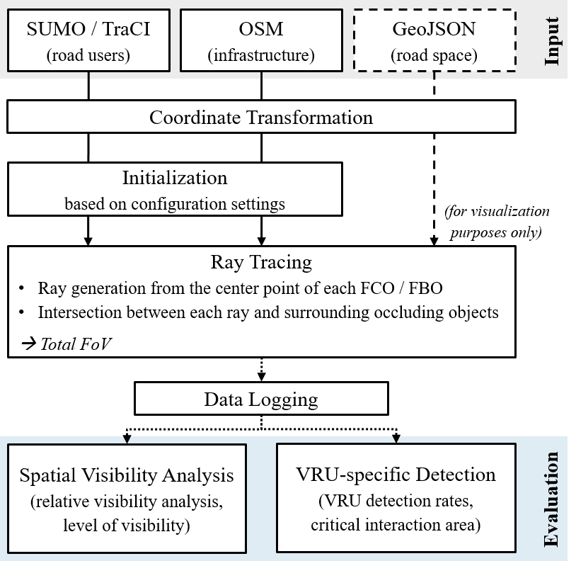
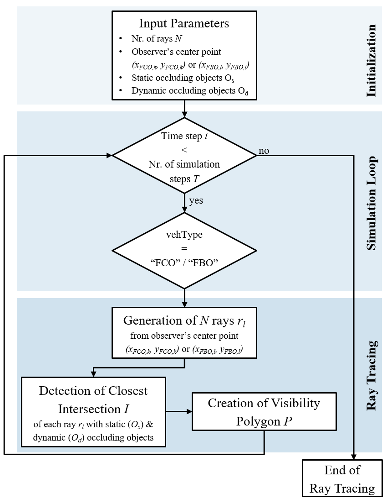
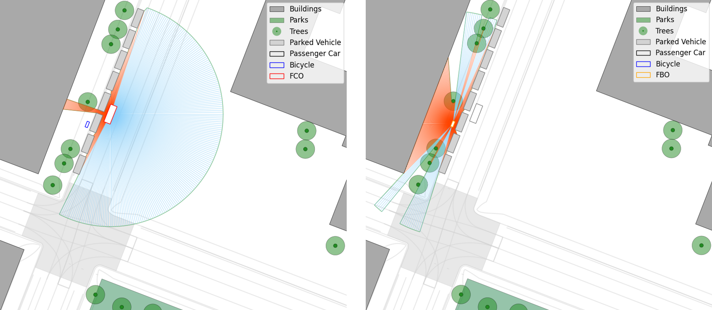
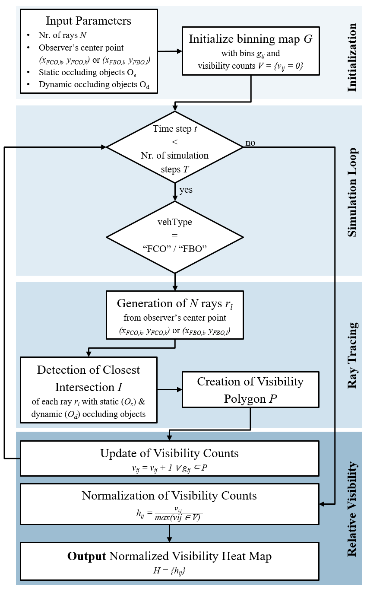
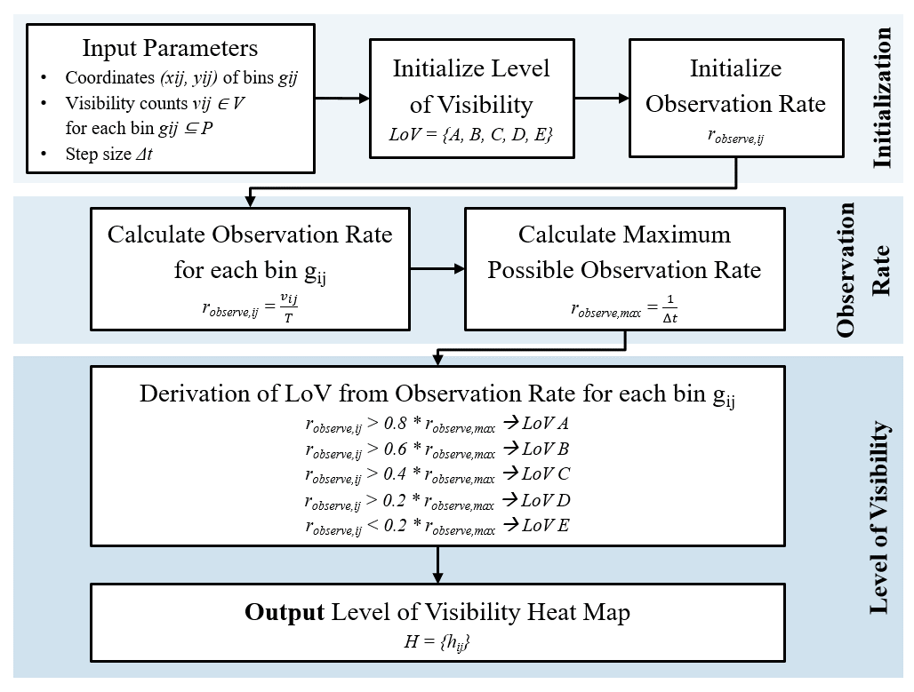

# FTO-Sim
*FTO-Sim* is an open-source simulation framework for Floating Traffic Observation (FTO). The FTO concept is adapted from the Floating Car Observer (FCO) method, that utilizes extended floating car data (xFCD) for traffic planning and traffic management purposes. Additionally, this simulation framework introduces further observer vehicle types, such as Floating Bike Observers (FBO).

For this, *FTO-Sim* is connected to a SUMO simulation and customized according to the user's needs. This ReadMe file serves as documentation for *FTO-Sim* and describes the single modules of the simulation framework as well as its customization and initialization.

## Table of Contents
1. [Citation](#citation)
2. [Features](#features)
3. [Installation / Prerequisites](#installation--prerequisites)
4. [Usage](#usage)

## Citation
When using *FTO-Sim*, please cite the following references:
* [Introduction of FTO-Sim](https://www.researchgate.net/publication/383272173_An_Open-Source_Framework_for_Evaluating_Cooperative_Perception_in_Urban_Areas) includes a detailed description of the general features of the simulation framework. Furthermore, a first application (visibility analysis) of the simulation framework is included to further calibrate the Level of Visibility (LoV) metric, originally introduced by [Pechinger et al.](https://www.researchgate.net/publication/372952261_THRESHOLD_ANALYSIS_OF_STATIC_AND_DYNAMIC_OCCLUSION_IN_URBAN_AREAS_A_CONNECTED_AUTOMATED_VEHICLE_PERSPECTIVE).

## Features
The following sub-chapters elaborate on the different modules and functionalities of the simulation framework, which are summarized in the figure below.



### Input Data

*FTO-Sim* makes use of three inut data types:
* [SUMO simulation](https://eclipse.dev/sumo/): SUMO and its interface TraCI (Traffic Control Interface) are used to retrieve the location of every static and dynamic road user for each time step of the simulation. Parked vehicles are considered static road users, while vehicular traffic, as well as VRUs (pedestrians and cyclists), are considered dynamic road users.
* [Open Streat Map (OSM)](https://www.openstreetmap.org/): Shapes and locations of static infrastructure elements, such as buildings, are retrieved from OSM. Furthermore, shapes and locations of urban greenery, such as parks and trees, are obtained from OSM.
* [GeoJSON](https://geojson.org/) (for visualizaton purposes only): If available, *FTO-Sim* makes use of GeoJSON files containing the road space distribution of the simulated scene to visualize vehicular carriageways, parking lots, bicycle lanes and pedestrian areas.

### Configuration Settings

*FTO-Sim* offers users a wide range of functionalities that can be individually configured before initializing the framework. This enables a customized use of the offered functionalities, dpending on the needs of individual users. The following configurations are available:
* The **general settings** enables users to activate the live visualization of the ray tracing procedure peformed by FCOs and FBOs. When the ray tracing visualization is activated, users can further choose if the generated rays themselves or only the resulting visibility polygon of FCOs and FBOs should be visualized. Additionally, a manual forwarding option is integrated, which, when activated, requests a user's input to proceed to the calculation of the next frame / simulation step. Furthermore, users can choose to save the animation after the simulation has been performed.
```
# General Settings

useLiveVisualization = True             # Live Visualization of Ray Tracing
visualizeRays = True                    # Visualize rays additionaly to the visibility polygon
useManualFrameForwarding = False        # Visualization of each frame, manual input necessary to forward the visualization
saveAnimation = True                    # Save the animation
```

* Through the **bounding box settings** users specify the entent of input data loading and the spatial boundaries of all further visualizations. The coordinates of the bounding box have to be provided in UTM format.
```
# Bounding Box Settings

north, south, east, west = 48.1505, 48.14905, 11.5720, 11.5669
bbox = (north, south, east, west)
```

* In the **path settings** users specify the location of the SUMO simulation's configuration file and, optionally, the location of the GeoJSON file used for the visualization of the road space distribution.
```
# Path Settings

base_dir = os.path.dirname(os.path.abspath(__file__))
parent_dir = os.path.dirname(base_dir)
sumo_config_path = os.path.join(parent_dir, 'SUMO_example', 'osm.sumocfg')              # Path to SUMO config-file
geojson_path = os.path.join(parent_dir, 'SUMO_example', 'TUM_CentralCampus.geojson')    # Path to GEOjson file
```

* The **warm-up settings** ensure an initial warm-up of the SUMO simulation to allow for the generation of a reasonable traffic demand within the simulated traffic network before activating the ray tracing method.
```
# Warm-Up Settings

delay = 90          #Warm-up time in seconds (during this time in the beginning of the simulation, no ray tracing is performed)
```

* In the **FCO / FBO settings** users define the penetration rates of both FCOs and FBOs individually. Every generated vehicle and / or bicycle in the SUMO simulation is assigned a random number of a uniform distribution ranging between [0, 1] and if this number os below the defined FCO / FBO penetration rate, the vehicle or bicycle is assigned the vehicle type 'floating car observer' or 'floating bike observer', respectively. Furthermore, the number of rays that a FCO / FBO will generate during the ray tracing can be defined.
```
# FCO / FBO Settings

FCO_share = 0.1         # Penetration rate of floating car observers
FBO_share = 0.1         # Penetration rate of floating bike observers
numberOfRays = 360      # Number of rays generated for ray tracing
```

### Ray Tracing

Based on the provided input data and confiduration settings, *FTO-Sim* is initiated and performs the ray tracing method for every FCO and FBO. The following figure shows the working principle of the ray tracing method.



Once the **simulation loop** is initiated, *FTO-Sim* will check the vehicle type of every road user within the previously defined bounding box for each time step of the simulation. After the initially defined warm-up phase and depending on the defined FCO / FBO penetration rates, vehicles or bicycles with the vehicle type 'floating car observer' or 'floating bike observer' will be randomly generated and thus activating the ray tracing.

The **ray tracing module** will generate the previously defined number of rays descending from every observer's center point up to a distance of 30 meters. The angle between the rays will be equivallently sized to generate a non-occluded field of view (FoV) in a circular form around the observer. Subsequently, the rays that intersect with static or dynamic objects are cut to obtain an observer's occluded FoV. Lastly, the endpoints of all rays are connected to create an observer's visibility polygon representing the area within an observer's total FoV.

The following figure shows a visualization of the ray tracing method, both for FCOs (left) and FBOs (right). The rays emerging from the centerpoint of an observer are colored in blue when they are inobstructed and in red when they intersect with objects.



### Applications

Based on the ray tracing method, different applications of *FTO-Sim* are available and further will be developed and provided in future.

#### Relative Visibility

In parallel to the ray tracing, a binning map approach is followed to update the visibility count for every bin that is included within the FoV of a FCO / FBO for every time step of the simulation. The following figure shows the working principle of the relative visibility analysis that is performed in parallel to the ray tracing method previously described.



During the **initialization phase**, *FTO-Sim* initializes a binning map that divides the simulated scene into equivalently sized squares and sets the visibility count of each bin to zero. The size of the bins and, with that, the resolution of the following visibility analyses can be individually set by users.

The **realtive visibility module** updates the initialized binning map by increasing the visibility count for each bin within an observer's FoV by one. In case of overlapping FoV's of multiple observers, the visibility count is still increased by one, thus following the methodology proposed by [Pechinger et al.](https://www.researchgate.net/publication/372952261_THRESHOLD_ANALYSIS_OF_STATIC_AND_DYNAMIC_OCCLUSION_IN_URBAN_AREAS_A_CONNECTED_AUTOMATED_VEHICLE_PERSPECTIVE). The simulation loop is repeated until the simulation end is reached after which the final binning map and visibility counts are obtained. Additionally, the visibility counts are normalized by dividing each bin value by the maximum observed visibility count. Both resulting binning maps (raw visibility counts and normalized visibility counts) are saved for further processing. Finally, a heat map of the normalized visibility counts is generated providing a visual representation of the spatiotemporal characteristics of the potential data collection process of FCOs / FBOs.

#### Level of Visibility (LoV)
The LoV, as introduced by [Pechinger et al.](https://www.researchgate.net/publication/372952261_THRESHOLD_ANALYSIS_OF_STATIC_AND_DYNAMIC_OCCLUSION_IN_URBAN_AREAS_A_CONNECTED_AUTOMATED_VEHICLE_PERSPECTIVE), provides a metric for comparing visibility across different scenarios under varying conditions. By converting the raw visibility counts into an observation rate, defined as the frequency of observations of a bin over time, obtained from the observer's final FoV, it provides a time-dependent scale for the comparison of different scenarios. Subsequently, the observation rate is categorized int one of five discrete LoVs offering a simplified representation of an bserver's visibility conditions. The following figure gives an overview of the working principle of the LoV assessment.



Through the **initialization phase**, *FTO-Sim* initializes arrays for both the LoV as well as the observation rate.

The **observation rate** is then calculated for each bin by dividing the visibility count by the simulation time. The maximum possible observation rate is defined as the inverse of the simulation step size and, therefore, provides the possibility to account for differences in step sizes between different simulations.

Subsequently, the **level of visibility** for each bin is determined by assigning the observation rate to one of the five discrete LoVs, with the thresholds between different LoVs distributed equidistantly based on the maximum possible observation rate. Finally, a heat map of the simulated scene representing the assessed LoV for each bin is provided as a visual representation of the metric.

## Installation / Prerequisites

### Creation of an isolated virtual environment
It is recommended to initially create an isolated virtual environment (venv) that allows users to install Python packages without affecting the global Python installation on their system. Furthermore, it ensures that each project has its own set of dependencies isolated from others.

When creating a virtual environment, a new directory named 'venv' will be created in the current working directory. Inside the 'venv' directory, a copy of the Python interpreter will be placed, along with a 'Scripts' (or 'bin' on Ubuntu) directory that contains executables for Python and pip. The 'venv' directory will also include a 'Lib' directory where installed packages will be stored.

After creating the isolated virtual environment once, this step does not have to be executed again. In order to initially create the isolated virtual environment 'venv', execute the following code in the terminal:
```
python -m venv venv
```

### Activating the isolated virtual environment
Once 'venv' is created, users have to activate the virtual environment. This step should be performed every time, 'venv' is not activated anymore. Once activated, any Python commands will be contained within this virtual environment, preventing conflicts with other projects or system-wide packages. In order to activate the isolated environment 'venv', execute the following code in the terminal:
```
.\venv\Scripts\activate
```

If users encounter problems, when trying to activate the isolated virtual environment, it is often due to the Windows PowerShell's execution policy, which controls the ability to run scripts on the system. By default, PowerShell has a restrictive execution policy to prevent the execution of potentially harmful scripts. To resolve this issue, users can change the execution policy of Windows PowerShell to allow the script to run.

### Installation of required packages
Before using *FTO-Sim*, users have to make sure all necessary Python packages are installed. The file 'requirements.txt' lists all the necessary packages and their corresponding versions that are required to execute *FTO-Sim*. Users can easily install all required packages by executing the following code in the terminal:
```
pip install -r requirements.txt
```

## Usage

### General Usage
Depending on the customized configuration settings (see [Configuration Settings](#configuration-settings)), the use of *FTO-Sim* differs slightly. In general, it can be distinguished between three different use modes:
1. **Simulation Mode**: This use mode is available for an execution of *FTO-Sim* without any visualization. While decreasing the computational cost and therefore increasing simulation speed with this use mode, it does not provide any visual aids for checking the simulations correct performance. Therefore, this use mode is recommended for well-developed simulation scenarios. In order to initialize this use mode, users should set the following general settings, while all other configuration settings can be customized according to the user's needs (see [Configuration Settings](#configuration-settings)):
    ```
    # General Settings
    
    useLiveVisualization = False            # Live Visualization of Ray Tracing
    visualizeRays = False                   # Visualize rays additionaly to the visibility polygon
    useManualFrameForwarding = False        # Visualization of each frame, manual input necessary to forward the visualization
    saveAnimation = False                   # Save the animation
    ```

2. **Visualization Mode**: This use mode is available for an execution of *FTO-Sim* with a live visualization of the ray tracing method. While increasing the computational cost and therefore decreasing simulation speed with this use mode, it provides visual aids for checking the simulations correct performance. This use mode is recommended for simulation scenarios, that are not yet thoroughly developed or if a live visualization is wanted for e.g. demonstration purposes. In order to initialize this use mode, users should set the following general settings, while all other configuration settings can be customized according to the user's needs (see [Configuration Settings](#configuration-settings)):
    ```
    # General Settings
    
    useLiveVisualization = True             # Live Visualization of Ray Tracing
    visualizeRays = True                    # Visualize rays additionaly to the visibility polygon (can be set to 'False' in this use mode)
    useManualFrameForwarding = False        # Visualization of each frame, manual input necessary to forward the visualization
    saveAnimation = False                   # Save the animation (can be set to 'True' in this use mode)
    ```

3. **Debugging Mode**: This use mode is available for a step-wise execution of *FTO-Sim*, which, when activated, requests a user's input to proceed to the calculation of the next simulation step / frame. In order to initialize this use mode, users should set the following general settings, while all other configuration settings can be customized according to the user's needs (see [Configuration Settings](#configuration-settings)):
    ```
    # General Settings
    
    useLiveVisualization = True             # Live Visualization of Ray Tracing
    visualizeRays = True                    # Visualize rays additionaly to the visibility polygon (can be set to 'False' in this use mode)
    useManualFrameForwarding = True         # Visualization of each frame, manual input necessary to forward the visualization
    saveAnimation = False                   # Save the animation (can be set to 'True' in this use mode)
    ```

### Example
...