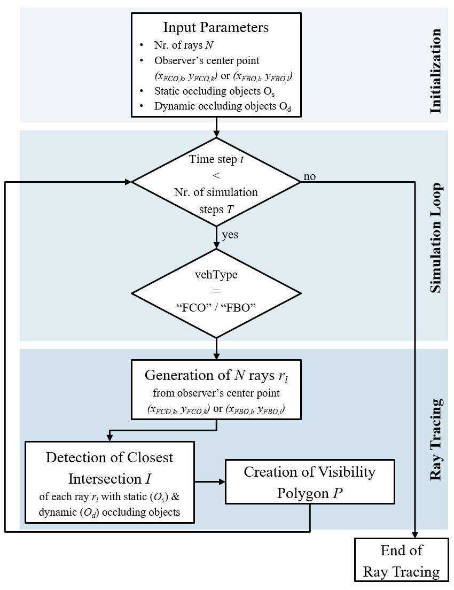
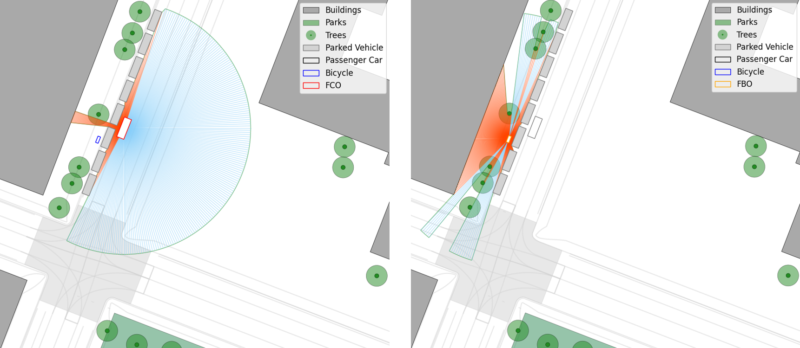
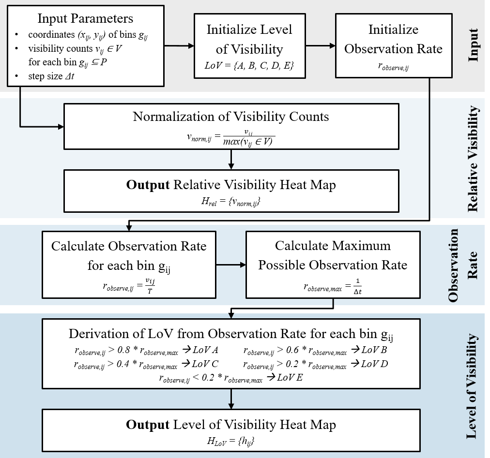
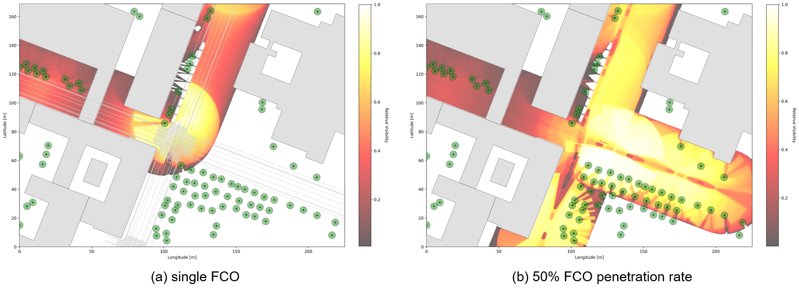
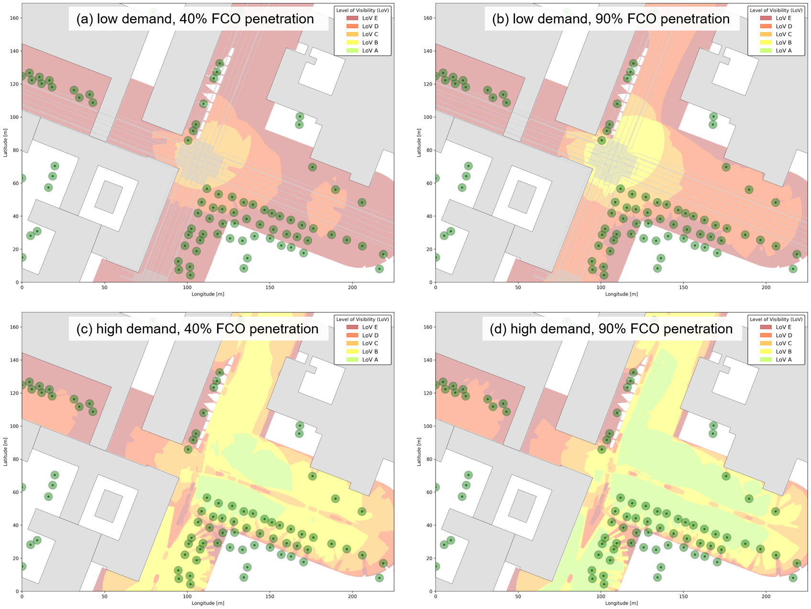
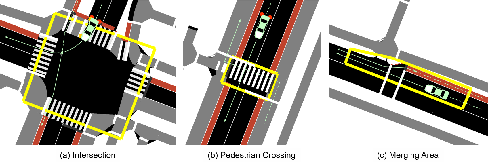
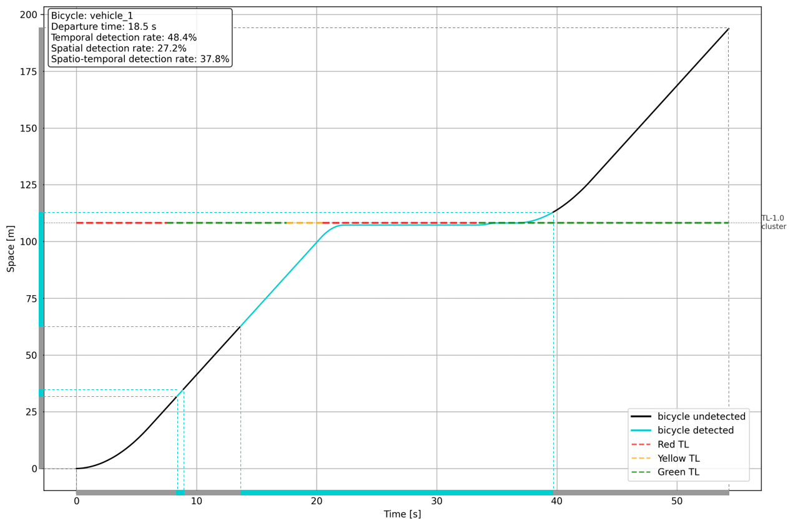
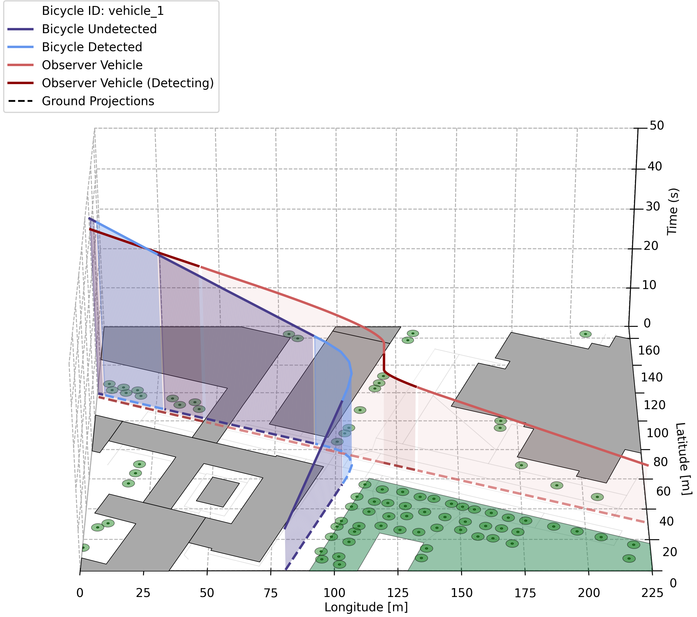

# FTO-Sim: An Open-Source Framework for Cooperative Perception Analysis

## Introduction

FTO-Sim is an open-source simulation framework for analyzing cooperative perception in urban traffic through the integration of microscopic traffic simulation and ray-tracing-based visibility analysis. The framework supports the evaluation of Floating Traffic Observers (FTOs), including Floating Car Observers (FCOs) and Floating Bike Observers (FBOs), in a range of traffic scenarios.

The framework extends the traditional Floating Car Observer concept to multiple observer types and focuses on how static and dynamic occlusion affect visibility and detection performance, especially for vulnerable road users (VRUs). By combining SUMO traffic simulation with geometric occlusion modeling, FTO-Sim enables both infrastructure-wide visibility assessment and trajectory-level VRU detection analysis.

## About This Documentation

This README combines methodological documentation with practical usage guidance. It is intended both as:

- a reference for understanding the scientific and computational workflow implemented in FTO-Sim
- a user guide for setting up and running the included scripts and simulation examples

## Repository Scope

To match the pushed repository scope, this README describes only the following scripts:

- `scripts/main.py`
- `scripts/performance_optimizer.py`
- `scripts/evaluation_spatial_visibility.py`
- `scripts/evaluation_VRU_specific_detection.py`

and only the following simulation example folders:

- `simulation_examples/Intersection-Redesign_Ilic-TR-PartA-2026`
- `simulation_examples/Spatial-Visibility_Ilic-TRB-2025`
- `simulation_examples/VRU-specific-Detection_Ilic-TRA-2026`

## Table of Contents

1. [Citation](#citation)
   1. [Primary References](#primary-references)
   2. [Example and Paper Mapping](#example-and-paper-mapping)
2. [Framework Architecture](#framework-architecture)
3. [Installation and Prerequisites](#installation-and-prerequisites)
   1. [System Requirements](#31-system-requirements)
   2. [SUMO Installation](#32-sumo-installation)
   3. [Python Environment Setup](#33-python-environment-setup)
   4. [Optional GPU Acceleration](#34-optional-gpu-acceleration)
4. [Configuration](#configuration)
   1. [Configuration Overview](#41-configuration-overview)
   2. [Performance Optimization Settings](#42-performance-optimization-settings)
   3. [Path Configuration](#43-path-configuration)
   4. [Bounding Box and OSM Settings](#44-bounding-box-and-osm-settings)
   5. [Observer Settings](#45-observer-settings)
   6. [Ray Tracing Settings](#46-ray-tracing-settings)
   7. [Visualization Settings](#47-visualization-settings)
   8. [Data Collection Settings](#48-data-collection-settings)
5. [Methodology](#methodology)
   1. [Input Data Model](#51-input-data-model)
   2. [Coordinate and Geometry Pipeline](#52-coordinate-and-geometry-pipeline)
   3. [Observer Assignment](#53-observer-assignment)
   4. [Ray Tracing and Occlusion Logic](#54-ray-tracing-and-occlusion-logic)
   5. [Visibility Polygon and Grid Updates](#55-visibility-polygon-and-grid-updates)
   6. [Relative Visibility and LoV](#56-relative-visibility-and-lov)
   7. [VRU-Specific Detection Evaluation](#57-vru-specific-detection-evaluation)
6. [Script-Level Documentation](#script-level-documentation)
   1. [main.py](#61-mainpy)
   2. [performance_optimizer.py](#62-performance_optimizerpy)
   3. [evaluation_spatial_visibility.py](#63-evaluation_spatial_visibilitypy)
   4. [evaluation_VRU_specific_detection.py](#64-evaluation_vru_specific_detectionpy)
7. [Simulation Examples](#simulation-examples)
   1. [Intersection-Redesign_Ilic-TR-PartA-2026](#71-intersection-redesign_ilic-tr-parta-2026)
   2. [Spatial-Visibility_Ilic-TRB-2025](#72-spatial-visibility_ilic-trb-2025)
   3. [VRU-specific-Detection_Ilic-TRA-2026](#73-vru-specific-detection_ilic-tra-2026)
8. [Typical Workflow](#typical-workflow)
9. [License](#license)

## Citation

When using FTO-Sim in research, cite the relevant publication(s) associated with the framework and the simulation example you use.

### Primary References

- **Ilic, M., et al.** (2026). "Simulation-Based Policy Evaluation for VRU Safety under Cooperative Perception: Linking Occlusion Modeling to Detection Performance" *Transportation Research Part A: Policy and Practice*. *(in peer-review process)*

THis paper introduces revised metrics for spatial visibility analysis and VRU-specific detection evaluation and applies them to a case study for intersection redesigns. Furthermore, a methodology for spatial evaluation of full occlusion hotspots is introduced that allows for recommendations on targeted V2I sensor deployment in a cooperative perception context.

- **Ilic, M., et al.** (2026). "FTO-Sim: An Open-Source Framework for Evaluating Cooperative Perception in Urban Areas." *European Transport Research Review*. *(in press after peer-review process)*

This paper presents the broader framework, including both spatial visibility analysis and VRU-specific detection evaluation.

- [**Ilic, M., et al.**](https://www.researchgate.net/publication/383272173_An_Open-Source_Framework_for_Evaluating_Cooperative_Perception_in_Urban_Areas) (2025). "An Open-Source Framework for Evaluating Cooperative Perception in Urban Areas." *Transportation Research Board 104th Annual Meeting*, Washington D.C., USA.

This paper introduces the first FTO-Sim version and the initial implementation of spatial visibility analysis and LoV-based evaluation.

### Example and Paper Mapping

- **Spatial-Visibility_Ilic-TRB-2025**
  - Related conference paper: Ilic et al. (2025), 104th Annual Meeting of the Transportation Research Board (TRB)
  - Title: "An Open-Source Framework for Evaluating Cooperative Perception in Urban Areas"
  - Focus: foundational FTO-Sim workflow and spatial visibility / LoV analysis

- **VRU-specific-Detection_Ilic-TRA-2026**
  - Related conference paper: Ilic et al. (2026), Transport Research Arena (TRA)
  - Title: "Evaluating Cyclist Visibility in Urban Intersections through Cooperative Perception under Different Speed Limits"
  - Focus: VRU-specific detection performance, including speed-limit scenario comparison

- **Intersection-Redesign_Ilic-TR-PartA-2026**
  - Related journal paper: Ilic et al. (2026), *Transportation Research Part A: Policy and Practice* (Special Issue on Safety in Smart Transportation Systems: Empirical Evidence and Policy Innovations)
  - Title: "Simulation-based Policy Evaluation for VRU Safety under Cooperative Perception: Linking Occlusion Modeling to Detection Performance"
  - Focus: infrastructure and traffic-policy scenario comparisons

## Framework Architecture

FTO-Sim combines traffic simulation, ray tracing, and post-processing in a modular sequence.


*Figure 1: High-level architecture and data flow.*

Core phases:

1. Scenario loading from SUMO inputs
2. Optional contextual enrichment with OpenStreetMap and GeoJSON data
3. Observer assignment and per-timestep ray tracing
4. Visibility and detection logging during simulation
5. Post-processing into spatial visibility and VRU-specific metrics

## Installation and Prerequisites

### 3.1 System Requirements

Minimum recommended setup:

- Windows 10/11, Linux, or macOS
- Python 3.10 or higher
- SUMO 1.20.0 or higher
- 8 GB RAM minimum, 16 GB or more recommended

Recommended for larger studies:

- multi-core CPU for parallel processing
- NVIDIA GPU with CUDA support for optional acceleration
- SSD storage for faster data access

### 3.2 SUMO Installation

FTO-Sim requires a working SUMO installation because `scripts/main.py` retrieves runtime vehicle states through libsumo/TraCI.

Basic verification command:

```bash
sumo --version
```

### 3.3 Python Environment Setup

A virtual environment is recommended.

```powershell
python -m venv venv
.\venv\Scripts\Activate.ps1
pip install -r requirements.txt
```

If PowerShell blocks activation:

```powershell
Set-ExecutionPolicy -ExecutionPolicy RemoteSigned -Scope CurrentUser
```

### 3.4 Optional GPU Acceleration

FTO-Sim supports optional GPU acceleration for large scenarios.

Relevant optional packages:

- `cupy-cuda11x` or `cupy-cuda12x`
- `numba`

If GPU support is unavailable, the framework falls back to CPU-based execution.

## Configuration

All main simulation settings are configured in the configuration section at the top of `scripts/main.py`.

### 4.1 Configuration Overview

The configuration block is organized into groups for:

- simulation identification
- performance optimization
- input paths
- geographic boundaries
- observer penetration rates
- ray tracing parameters
- visualization
- data collection

### 4.2 Performance Optimization Settings

FTO-Sim supports three execution modes:

- `"none"`: single-threaded, highest compatibility
- `"cpu"`: multi-threaded CPU execution
- `"gpu"`: CPU multi-threading with GPU acceleration

`performance_optimizer.py` contains profiling and optimized helper routines used by `main.py` for these accelerated execution paths.

### 4.3 Path Configuration

The most important paths are:

- `sumo_config_path`
- `geojson_path` (optional)

These are typically set to one of the included example scenarios.

### 4.4 Bounding Box and OSM Settings

The study area is defined through a geographic bounding box in WGS84:

- `north`
- `south`
- `east`
- `west`

Optional OpenStreetMap layers can be enabled or disabled, including:

- buildings
- parks
- trees
- barriers
- PT shelters

### 4.5 Observer Settings

Observer penetration is controlled through:

- `FCO_share`
- `FBO_share`

These values specify the share of eligible motorized vehicles or bicycles assigned as observers.

### 4.6 Ray Tracing Settings

The key parameters are:

- `numberOfRays`
- `radius`
- `grid_size`
- `single_sensor_accuracy`

These determine angular resolution, sensing range, spatial aggregation, and continuous visibility weighting.

### 4.7 Visualization Settings

Visualization-related flags include:

- `useLiveVisualization`
- `visualizeRays`
- `useManualFrameForwarding`
- `saveAnimation`

These should typically be disabled for large production runs.

### 4.8 Data Collection Settings

The main logging controls include:

- `COLLECT_DETECTION_LOGS`
- `COLLECT_BICYCLE_TRAJECTORIES`
- `COLLECT_VEHICLE_TRAJECTORIES`
- `COLLECT_CONFLICT_DATA`
- `COLLECT_FLEET_COMPOSITION`
- `COLLECT_TRAFFIC_LIGHT_DATA`

Disabling unnecessary logging can substantially reduce runtime and memory usage.

## Methodology

### 5.1 Input Data Model

At runtime, `scripts/main.py` combines:

- dynamic entities from SUMO via libsumo/TraCI
- scenario topology and demand from SUMO network, route, and additional files
- optional geospatial context from OpenStreetMap and GeoJSON

The simulation distinguishes between:

- **static occluders**: infrastructure and static scene elements
- **dynamic occluders**: moving road users at the current timestep

### 5.2 Coordinate and Geometry Pipeline

The processing pipeline harmonizes multiple coordinate systems into one projected geometry space for robust intersection calculations.

This enables:

- stable polygon and ray computations
- metric grid-based visibility aggregation
- consistent spatial plotting

### 5.3 Observer Assignment

Observer assignment is controlled by `FCO_share` and `FBO_share`.

For each eligible road user, assignment follows a seeded stochastic decision:

$$
\text{observer} =
\begin{cases}
1 & \text{if } u < p \\
0 & \text{otherwise}
\end{cases}
\quad \text{with } u \sim U(0,1),\; p \in \{p_{\mathrm{FCO}},\,p_{\mathrm{FBO}}\}
$$

This ensures reproducible observer placement while preserving randomized assignment.

### 5.4 Ray Tracing and Occlusion Logic

For each active observer and timestep after warm-up:

1. Generate `numberOfRays` around 360 degrees
2. Limit each ray to `radius`
3. Intersect each ray against static and dynamic geometry
4. Truncate at the nearest hit

The visible ray endpoints describe the effective line-of-sight under occlusion.



*Figure 2: Ray tracing sequence used in simulation.*



*Figure 3: Example ray-level visibility and occlusion outcome.*

### 5.5 Visibility Polygon and Grid Updates

Ray endpoints are angularly ordered and connected to create a visibility polygon per observer and frame.

A spatial grid is updated using two counters:

- **Discrete visibility counter**: binary frame-based increment when a cell is visible
- **Continuous visibility counter**: weighted increment based on sensor accuracy and simultaneous observer redundancy

The continuous measure increases confidence when multiple observers simultaneously cover the same cell.

### 5.6 Relative Visibility and LoV

Post-processing in `scripts/evaluation_spatial_visibility.py` computes:

- **Relative Visibility**
- **Discrete Level of Visibility (LoV)**
- **Continuous Level of Visibility (LoV)**

LoV normalization follows:

$$
\mathrm{LoV}(i) = \frac{C_i}{N_{\text{steps}} \cdot \Delta t}
$$

where:

- $C_i$ is the visibility count for grid cell $i$
- $N_{\text{steps}}$ is the total number of simulation steps
- $\Delta t$ is simulation step length

Cells with no observations remain NaN during visualization to distinguish unobserved cells from weakly observed cells.



*Figure 4: Spatial visibility post-processing flow.*



*Figure 5: Relative visibility output example.*



*Figure 6: LoV class-based output example.*

### 5.7 VRU-Specific Detection Evaluation

`scripts/evaluation_VRU_specific_detection.py` evaluates bicycle or VRU detectability over time and space, including:

- trajectory-level detection status
- detection redundancy
- occlusion-level representations
- optional conflict-focused and 3D views
- summary statistics



*Figure 7: Critical interaction area context used in VRU-focused analyses.*



*Figure 8: Example 2D VRU detection trajectory output.*



*Figure 9: Example 3D VRU detection output.*

## Script-Level Documentation

### 6.1 main.py

`main.py` is the central simulation entry point.

Main responsibilities:

- scenario and runtime configuration
- SUMO startup and simulation stepping
- observer assignment
- ray tracing and visibility polygon generation
- grid visibility counting
- logging detections, trajectories, conflicts, and summaries

Typical command:

```powershell
python scripts/main.py
```

### 6.2 performance_optimizer.py

`performance_optimizer.py` provides optimization and profiling utilities used by `main.py`.

Main responsibilities:

- profiling support for performance diagnostics
- optimized computational paths for ray-processing hotspots
- CPU and GPU oriented helper logic used by the runtime

### 6.3 evaluation_spatial_visibility.py

`evaluation_spatial_visibility.py` performs post-processing for spatial visibility metrics.

Main outputs:

- relative visibility heatmaps
- discrete LoV maps and logs
- continuous LoV maps and logs

Typical command:

```powershell
python scripts/evaluation_spatial_visibility.py --scenario-path <scenario_output_folder>
```

### 6.4 evaluation_VRU_specific_detection.py

`evaluation_VRU_specific_detection.py` performs VRU-focused post-processing.

Main outputs:

- 2D trajectory detection plots
- flow-based, redundancy, and occlusion-level outputs
- optional 3D visualizations
- summary statistics files

Typical command:

```powershell
python scripts/evaluation_VRU_specific_detection.py --scenario-path <scenario_output_folder>
```

## Simulation Examples

### 7.1 Intersection-Redesign_Ilic-TR-PartA-2026

Case-study family for infrastructure and policy redesign comparisons.

Available SUMO configurations:

- `50_low_demand.sumocfg`
- `50_low_demand_30.sumocfg`
- `50_low_demand_no-parking.sumocfg`
- `high_demand.sumocfg`
- `high_demand_30.sumocfg`
- `high_demand_no-parking.sumocfg`
- `high_demand_singleFCO.sumocfg`

Study focus:

- demand-level comparison
- speed reduction scenarios
- removal of on-street parking
- targeted observer placement experiment

### 7.2 Spatial-Visibility_Ilic-TRB-2025

Spatial visibility benchmark scenario family.

Available SUMO configurations:

- `Ilic-2025_config_low-demand.sumocfg`
- `Ilic-2025_config_high-demand.sumocfg`

Study focus:

- relative visibility patterns
- Level of Visibility (LoV)
- demand-related spatial observability

### 7.3 VRU-specific-Detection_Ilic-TRA-2026

VRU detection scenario family with speed-limit variants.

Available SUMO configurations:

- `Ilic-2026_config_30kmh.sumocfg`
- `Ilic-2026_config_50kmh.sumocfg`

Study focus:

- cyclist and VRU visibility
- detection performance in critical interaction areas
- comparison of 30 km/h and 50 km/h scenarios

## Typical Workflow

1. Choose one of the included simulation example scenarios.
2. Configure the relevant paths and parameters in `scripts/main.py`.
3. Run the simulation:

```powershell
python scripts/main.py
```

4. Run spatial visibility evaluation if needed:

```powershell
python scripts/evaluation_spatial_visibility.py --scenario-path <scenario_output_folder>
```

5. Run VRU-specific detection evaluation if needed:

```powershell
python scripts/evaluation_VRU_specific_detection.py --scenario-path <scenario_output_folder>
```

## License

See `LICENSE`.