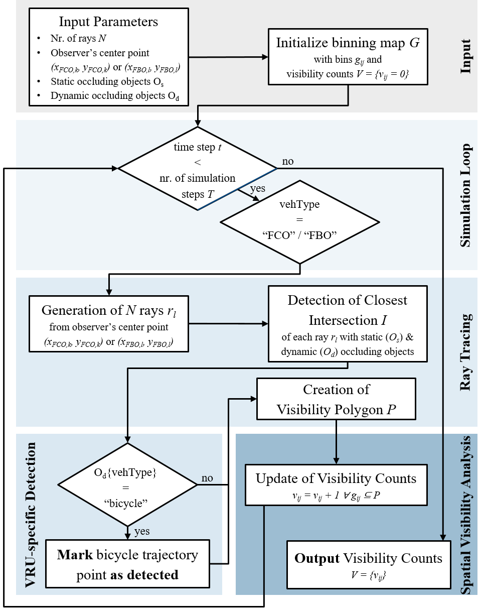
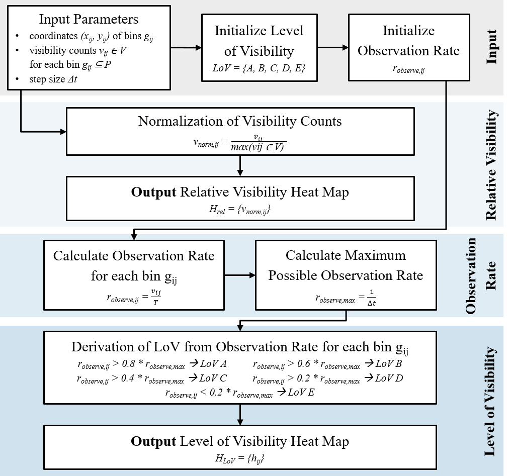
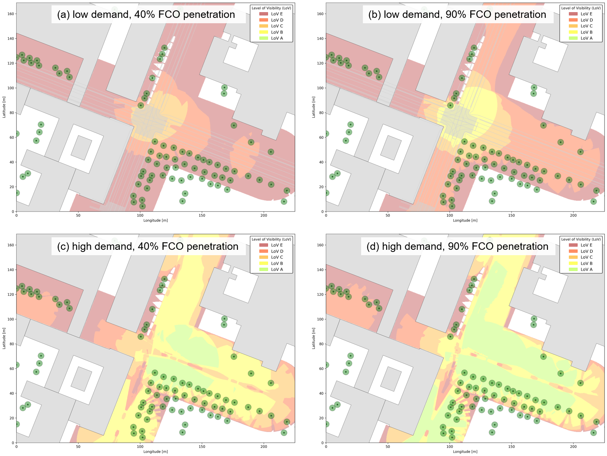
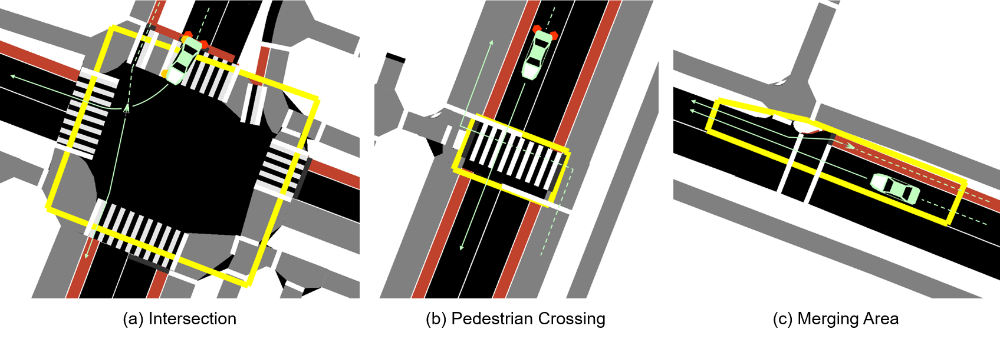

# FTO-Sim

## Introduction

*FTO-Sim* is an open-source simulation framework for Floating Traffic Observation (FTO) that integrates SUMO traffic simulation with advanced ray tracing techniques to analyze the visibility coverage of Floating Car Observers (FCOs) and Floating Bike Observers (FBOs) in urban environments. The framework enables comprehensive evaluation of cooperative perception systems and their effectiveness in detecting vulnerable road users.

The FTO concept is adapted from the Floating Car Observer (FCO) method, utilizing extended floating car data (xFCD) for traffic planning and traffic management purposes. Additionally, *FTO-Sim* introduces further observer vehicle types, such as Floating Bike Observers (FBO).

## About This Documentation

This README file serves as comprehensive documentation for *FTO-Sim*, combining methodological explanations of the framework with practical user instructions. It provides detailed descriptions of the ray tracing algorithm and subsequent evaluation metrics, alongside step-by-step configuration guides, usage examples, and implementation details.

## Table of Contents
1. [Citation](#citation)
    1. [Primary Reference](#primary-reference)
    2. [Secondary References](#secondary-references)
2. [Framework Architecture](#framework-architecture)
    1. [Input Data Processing](#1-input-data-processing)
    2. [Coordinate Transformation](#2-coordinate-transformation)
    3. [Configuration & Initialization](#3-configuration--initialization)
    4. [Ray Tracing](#4-ray-tracing)
    5. [Data Logging](#5-data-logging)
    6. [Evaluation Metrics](#6-evaluation-metrics)
3. [Ray Tracing](#ray-tracing)
    1. [Methodology](#methodology)
    2. [Ray Tracing Algorithm](#ray-tracing-algorithm)
    3. [Visualization and Output](#visualization-and-output)
4. [Data Collection and Logging](#data-collection-and-logging)
    1. [Output Directory Structure](#output-directory-structure)
    2. [Log File Specifications](#log-file-specifications)
    3. [Data Processing and Analysis](#data-processing-and-analysis)
5. [Evaluation Metrics](#evaluation-metrics)
    1. [Spatial Visibility Analysis](#spatial-visibility-analysis)
    2. [VRU-Specific Detection](#vru-specific-detection)
6. [Installation / Prerequisites](#installation--prerequisites)
    1. [Creating a Virtual Environment](#creating-a-virtual-environment)
    2. [Activating the Virtual Environment](#activating-the-virtual-environment)
    3. [Installation of Required Packages](#installation-of-required-packages)
7. [Configuration](#configuration)
    1. [General Settings](#general-settings)
    2. [Ray Tracing Settings](#ray-tracing-settings)
    3. [Visualiation Settings](#visualization-settings)
    4. [Data Collection Settings](#data-collection-settings)
8. [Usage](#usage)
    1. [Simulation Mode](#simulation-mode)
    2. [Visualization Mode](#visualization-mode)
    3. [Debugging Mode](#debugging-mode)
    4. [Saving Mode](#saving-mode)
9. [Simulation Examples](#simulation-examples)
    1. [Spatial Visibility Analysis (Ilic — TRB 2025)](#spatial-visibility-analysis-ilic--trb-2025)
    2. [VRU-specific Detection (Ilic — TRA 2026)](#vru-specific-detection-ilic--tra-2026)

## Citation
When using *FTO-Sim*, please cite the following references:

### Primary Reference

* **Ilic, M., et al.** "FTO-Sim: An Open-Source Framework for Evaluating Cooperative Perception in Urban Areas." *European Transport Research Review*, 2024. *(Publication pending - [Link will be available upon publication])*

This paper presents the current version of the FTO-Sim framework with comprehensive methodological foundations and explanations about implemented evaluation metrics. Besides *spatial visibility analysis*, additional evaluation metrics, including *VRU-specific detection*, are implemented and described. Furthermore, the paper introduces simulation examples included in *FTO-Sim*, that enable a fast applpication of the simulation framework for other users.

### Secondary References

* [**Ilic, M., et al.**](https://www.researchgate.net/publication/383272173_An_Open-Source_Framework_for_Evaluating_Cooperative_Perception_in_Urban_Areas) "An Open-Source Framework for Evaluating Cooperative Perception in Urban Areas." *Transportation Research Board 104th Annual Meeting*, Washington D.C., 2025. *(Accepted for presentation)*

This paper introduces the initial version of FTO-Sim with a first implementation of spatial visibility analysis metrics. It presents the foundational occlusion modeling approach and demonstrates the framework's capability for analyzing relative visibility patterns and the Level of Visibility (LoV),  originally introduced by [Pechinger et al.](https://www.researchgate.net/publication/372952261_THRESHOLD_ANALYSIS_OF_STATIC_AND_DYNAMIC_OCCLUSION_IN_URBAN_AREAS_A_CONNECTED_AUTOMATED_VEHICLE_PERSPECTIVE). Through a case study, potential for further calibration of the LoV metric have been identified.

## Framework Architecture
The following sub-chapters elaborate on the different modules and functionalities of *FTO-Sim*, which are organized in a modular workflow as illustrated in the figure below.


*Figure 1: Workflow of FTO-Sim*

The FTO-Sim framework consists of six core modules that work together to provide comprehensive cooperative perception analysis:

### 1. Input Data Processing
*FTO-Sim* integrates three primary data sources to create and visualize a comprehensive urban simulation scene:

- **SUMO Simulation**: *FTO-Sim* communicates with a microscopic traffic simulation using SUMO and its integrated TraCI interface (Traffic Control Interface) to retrieve the positions of all static and dynamic road users at each simulation time step. Parked vehicles are treated as static road users, while vehicular traffic and VRUs are treated as dynamic road users. *FTO-Sim* is expecting the path to a SUMO configuration file (`.sumocfg`), which it will use for live communication with the traffic simulation through the TraCI interface to retrieve information from the SUMO network file (`.net.xml`), traffic demand files (`.rou.xml`) and additional files (`.add.xml`).

- **OpenStreetMap (OSM) Data**: Additionally, *FTO-Sim* loads static infrastructure elements, such as buildings or urban greenery (e.g. parks and trees) from OSM, which will be considered during the ray tracing simulation (see [Ray Tracing](#ray-tracing)).

- **GeoJSON Files** *(optional)*: If available, a GeoJSON file can be used by *FTO-Sim* to visualize the distribution of road space to support a faster understanding of the simulated scene.

### 2. Coordinate Transformation
After loading all spatial input data, *FTO-Sim* performs automated coordinate system transformations to ensure spatial consistency between different data sources. This module handles conversions between SUMO's local coordinate system, WGS84 geographic coordinates (from OSM and GeoJSON), and projected coordinate systems (UTM) for accurate geometric calculations.

### 3. Configuration & Initialization
*FTO-Sim* offers a wide range of functionalities and allows customization of, amongst others, essential simulation parameters such as the spatial extent of the simulated scene (bounding box), warm-up duration of the SUMO simulation, observer penetration rates, and the number and length of rays generated during ray tracing. Based on this user-defined configuration (see [Configuration](#configuration)), *FTO-Sim* initializes the simulation and performs the ray tracing method for every observer vehicle.

### 4. Ray Tracing
Based on the provided input data and configuration settings, *FTO-Sim* performs the ray tracing method for every observer vehicle (FCO and FBO) to determine the final field of view (FoV) of each observer. The module performs 360-degree ray generation around observer vehicles and intersects each ray with static (buildings, trees, etc.) and dynamic objects (other road users) to account for occlusion effects in the simulated scene.

Key configurable features include (see [Usage](#usage)):
- **Ray Parameters**: Number of rays (e.g., 360 rays for 1° resolution) and maximum ray length (typically set to 30 meters)
- **Performance Options**: Multi-threaded processing with optional GPU acceleration
- **Visualization Capabilities**: Real-time ray tracing visualization during run-time or video generation and saving for later demonstration purposes

Connecting the endpoints of all (occluded and non-occluded) rays forms the visibility polygon, which reresents the final FoV of an observer vehicle. For detailed methodological explanations of the ray tracing nodule, ray intersection, and visibility polygon generation, see [Ray Tracing](#ray-tracing).

### 5. Data Logging
The comprehensive data collection system captures detailed simulation values throughout the ray tracing process. *FTO-Sim* generates multiple structured CSV log files, each containing specific data categories for comprehensive analysis. Data is logged in real-time during simulation with consistent coordinate systems (UTM) and temporal resolution.

**Generated Log Files:**

- **`summary_log_*.csv`**: Simulation overview with configuration parameters, overall simulation statistics and performance metrics
- **`log_fleet_composition_*.csv`**: Vehicle fleet composition with number of generated and currently in the simulation present vehicles per vehicle type (for each simulation time step)
- **`log_vehicle_trajectories_*.csv`**: Motorized vehicle trajectory data including position, speed, acceleration, distance traveled, distance to leader/follower vehicles, distance to next traffic light and detection information (for each time step)
- **`log_bicycle_trajectories_*.csv`**: Bicycle trajectory data including position, speed, acceleration, distance traveled, distance to next traffic light and detection information (for each time step)
- **`log_detections_*.csv`**: Detection events between observers and bicycles including coordinates, distances, and vehicle speeds (of observers and observed road users)
- **`log_traffic_lights_*.csv`**: Traffic light information including phases, queue lengths, waiting times, and signal state changes (for each time step)
- **`log_conflicts_*.csv`**: SUMO-native conflict analysis data including time-to-collision (TTC), post-encroachment-time (PET), and deceleration to avoid crash (DRAC) metrics

For detailed information about data analysis and processing, see [Data Collection and Logging](#data-collection-and-logging).

### 6. Evaluation Metrics
Post-processing analysis modules that generate evaluation metrics from logged simulation data (see [Evaluation Metrics](#evaluation-metrics)):

- **Spatial Visibility Analysis**: Generates heat maps and statistical measures of visibility coverage across the study area, including relative visibility patterns and level of visibility (LoV) assessments.

- **VRU-Specific Detection**: Analyzes detection performance for VRUs including spatio-temporal detection rates and a specific focus to critical interaction areas.

## Ray Tracing

Based on the input data provided and the configuration settings, the simulation framework is initiated and performs the ray tracing method for every FCO and FBO. In parallel, a binning map approach is used to update the visibility count of each bin included within an observer's FoV at every simulation time step. An overview of the ray tracing method and internal data gathering for subsequent evaluation purposes (spatial visibility analysis and VRU-specific detection) is given in the following figure.


*Figure 2: Workflow of the Ray Tracing Method*

### Methodology

#### Initialization
When initializing the ray tracing method, *FTO-Sim* loads the required input parameters and sets up a binning map that divides the simulated scene into equally sized squares, with each bin's visibility count initially set to zero. Besides the number and length of rays descending from an observer's center point, the bin size, which determines the resolution of the subsequent spatial visibility analyses, can be configured by the user (see [Configuration](#configuration)).

#### Simulation Loop and Observer Assignment
Once the simulation loop starts, *FTO-Sim* checks the vehicle type of each road user within the predefined bounding box at each time step. After the warm-up phase and according to the specified FCO / FBO penetration rates, vehicles or bicycles are assigned the vehicle type 'floating car observer' or 'floating bike observer', thereby activating the ray tracing.

**Observer Types and Assignment Process:**
Every generated vehicle and/or bicycle in the SUMO simulation is assigned a random number from a uniform distribution ranging between [0, 1]. If this number is below the defined FCO/FBO penetration rate, the vehicle or bicycle is assigned the vehicle type 'floating car observer' or 'floating bike observer', respectively.
1. **FCOs (Floating Car Observers)**: Assignment of passenger cars based on configured FCO penetration rate using a fixed seed value for reproducible results
2. **FBOs (Floating Bike Observers)**: Assignment of bicycles based on configured FBO penetration rate using a fixed seed value for reproducible results

### Ray Tracing Algorithm

#### Ray Generation and Intersection Detection
For each observer, the ray tracing module generates the previously configured number of rays descending from the observer's center point and extending up to the previously defined length of the rays (representing the theoretical detection range of an observer). The angle between the rays is equivalently sized to generate a non-occluded FoV around the observer. Rays intersecting with static or dynamic objects are cut to account for occlusion, and the endpoints of all rays are connected to form the visibility polygon representing the observer’s total FoV.

**Key Processing Steps:**
1. **Ray Generation**: Each observer generates rays distributed in a 360° pattern within the specified radius (typically 30 meters)
2. **Occlusion Detection**: Rays are systematically tested for intersections with:
   - **Static objects**: Parked vehicles, obtained from SUMO, as well as buildings, trees, and further infrastructure elements obtained from OSM
   - **Dynamic objects**: Road users (motorized vehicles and VRUs) obtained from SUMO
3. **Ray Intersection**: Rays intersecting with static or dynamic objects are cut to account for occlusion effects
4. **Visibility Polygon Creation**: The endpoints of all rays (both occluded and non-occluded) are connected to form the visibility polygon representing the observer's total FoV

#### Internal Data Collection for Spatial Visibility Analysis
For spatial visibility analyses, the framework updates the binning map by increasing the visibility count of each bin within an observer's total FoV.

#### Internal Data Collection for VRU-specific Detection
If a ray intersects a dynamic object, the framework checks the object's vehicle type. If the object is a bicycle or pedestrian, the corresponding trajectory point is marked as detected for subsequent evaluation of VRU-specific detection.

#### Internal Data Logging
At the end of the simulation loop, the final visibility counts and marked bicycle trajectories are obtained.

### Visualization and Output

In addition to the numerical output, the framework offers flexible visualization options for the ray tracing method. Users can enable live visualization to directly observe the influence of static and dynamic occlusions on observer’s FoVs during runtime. Alternatively, the visualization can be exported as a video file, which allows for later inspection of detection events and facilitates communication of results. (see [Configuration](#configuration))

A visualization of the ray tracing method is provided in Figure 3. The rays emerging from the center point of an observer are colored blue when they are unobstructed, and red when they intersect with objects.


*Figure 3: Ray Tracing Visualization*

Figure 3a illustrates an FCO with its FoV obstructed from the VRU infrastructure by parked vehicles, while Figure 3b shows the same situation from the perspective of an FBO, whose FoV instead covers the VRU  infrastructure but is obstructed from the vehicular carriageway.

## Data Collection and Logging

*FTO-Sim* implements a comprehensive data collection system that captures detailed simulation parameters throughout the ray tracing process when `CollectLoggingData = True`. The framework generates structured output files organized in a systematic directory structure, enabling analysis of cooperative perception systems and traffic safety implications.

### Output Directory Structure

The simulation creates organized output directories with standardized naming conventions based on simulation configuration. Besides the {project-name} (name of input directory with SUMO simulation used to initialize *FTO-Sim*), the {file-tag} and observer penetration rates ({X} for FCO, {Y} for FBO penetration rate) are used to set the naming conventions:

```python
outputs/
└── {project-name}_{file_tag}_FCO{X}%_FBO{Y}%/
    ├── out_logging/                                               # Simulation log files
    │   ├── summary_log_{file_tag}.csv                               # Simulation overview
    │   ├── log_fleet_composition_{file_tag}.csv                     # Vehicle type and fleet composition
    │   ├── log_vehicle_trajectories_{file_tag}.csv                  # Motorized vehicle movement data
    │   ├── log_bicycle_trajectories_{file_tag}.csv                  # Bicycle movement data
    │   ├── log_detections_{file_tag}.csv                            # Observer-VRU detection events
    │   ├── log_conflicts_{file_tag}.csv                             # Conflict analysis
    │   └── log_traffic_lights_{file_tag}.csv                        # Signal control data
    ├── out_raytracing/                                            # Ray tracing output
    │   ├── visibility_counts_{file_tag}.csv                         # Grid-based visibility count data
    │   └── ray_tracing_animation__FCO{X}%_FBO{Y}%.mp4               # Ray tracing animation
    └── out_spatial_visibility/                                    # Spatial visibility analysis output
        ├── relative_visibility_heatmap_FCO{X}%_FBO{Y}%.png          # Relative visibility heatmap
        └── LoV_heatmap_FCO{X}%_FBO{Y}%.png                          # Level of visibility heatmap
    └── out_VRU-specific_detection/                                # VRU-specific detection output
        ├── detection_rates_{file_tag}_data.csv                      # Detailed detection performance
        ├── detection_rates_{file_tag}_summary.txt                   # Statistical summary
        ├── 2D_individual_{file_tag}_{vehicle_id}_summary.txt        # 2D individual bicycle trajectories
        └── 3D_detection_{file_tag}_{vehicle_id}.png                 # 3D individual bicycle detection
```

### Log File Specifications

#### Core Simulation Logging (`out_logging/`)

##### 1. Summary Log (`out_logging/summary_log_*.csv`)
- **Purpose**: Comprehensive simulation overview containing configuration parameters, performance summaries, fleet statistics, and system information in a structured text format.

- **Structure**: Text-based summary file with sections about:
  - Configuration parameters (FCO/FBO shares, ray settings, performance level)
  - Runtime and performance summary
  - Fleet composition statistics
  - Safety analysis summaries
  - Hardware and software specifications

- **Key Features**: Broader simulation documentation, reproducibility information, performance statistics

##### 2. Fleet Composition Log (`out_logging/log_fleet_composition_*.csv`)
- **Purpose**: Time-series tracking of fleet composition and observer presence throughout the simulation.

- **Column Structure**:
  time_step, new_DEFAULT_VEHTYPE_count, present_DEFAULT_VEHTYPE_count, new_floating_car_observer_count, present_floating_car_observer_count, new_DEFAULT_BIKETYPE_count, present_DEFAULT_BIKETYPE_count, new_floating_bike_observer_count, present_floating_bike_observer_count

- **Key Features**: Vehicle generation monitoring, fleet composition monitoring, observer penetration rate monitoring

##### 3. Vehicle Trajectory Log (`out_logging/log_vehicle_trajectories_*.csv`)
- **Purpose**: Movement and kinematic data for all motorized vehicles in the simulation.

- **Column Structure**:
  time_step, vehicle_id, vehicle_type, x_coord, y_coord, speed, angle, acceleration, lateral_speed, slope, distance, route_id, lane_id, edge_id, lane_position, lane_index, leader_id, leader_distance, follower_id, follower_distance, next_tls_id, distance_to_tls, length, width, max_speed

- **Key Features**: UTM coordinate positioning, microscopic traffic flow parameters, inter-vehicle relationship tracking, traffic signal interaction data

##### 4. Bicycle Trajectory Log (`out_logging/log_bicycle_trajectories_*.csv`)
- **Purpose**: VRU movement data with integrated detection status and realted traffic light tracking.

- **Column Structure**:
  time_step, vehicle_id, vehicle_type, x_coord, y_coord, speed, angle, acceleration, lateral_speed, slope, distance, route_id, lane_id, edge_id, lane_position, lane_index, is_detected, detecting_observers, in_test_area, next_tl_id, next_tl_distance, next_tl_state, next_tl_index

- **Key Features**: VRU-specific detection tracking, observer identification, critical area monitoring, realted traffic signal state tracking

##### 5. Detection Events Log (`out_logging/log_detections_*.csv`)
- **Purpose**: Spatial and temporal documentation of all observer-VRU detection events with contextual information.

- **Column Structure**:
  time_step, observer_id, observer_type, bicycle_id, x_coord, y_coord, detection_distance, observer_speed, bicycle_speed

- **Key Features**: Detection event logging, spatial relationship analysis, relative velocity tracking, observer type differentiation

##### 6. Conflict Analysis Log (`out_logging/log_conflicts_*.csv`)
- **Purpose**: Traffic safety assessment using SUMO's Surrogate Safety Measures (SSM) with detection coverage analysis.

- **Column Structure**:
  time_step, bicycle_id, foe_id, foe_type, x_coord, y_coord, distance, ttc, pet, drac, severity, is_detected, detecting_observer, observer_type

- **Key Features**: Time-to-Collision (TTC) calculations, Post-Encroachment-Time (PET) analysis, Deceleration Rate to Avoid Crash (DRAC) metrics, conflict severity assessment

- **Comment**: It has shown, that SUMO tends to classify events as potential conflicts, that in fact do not reflect real conflict-prone situations. Therefore, the evaluation of "conflict detection rates" has been dismissed.

##### 7. Traffic Light Data Log (`out_logging/log_traffic_lights_*.csv`)
- **Purpose**: Traffic signal information including programs, phases and signal states (including signal-to-lane mapping information). Additionally, queue lengths, number of stops and waiting times are tracked.

- **Column Structure**:
  time_step, traffic_light_id, program, phase, phase_duration, remaining_duration, signal_states, total_queue_length, vehicles_stopped, average_waiting_time, vehicles_by_type, lane_to_signal_mapping

- **Key Features**: Signal phase tracking, queue length monitoring, waiting time analysis, vehicle type distribution at signals

##### Visibility Counts (`out_raytracing/visibility_counts_*.csv`)
- **Purpose**: Grid-based visibility counts for generating relative visibility and LoV heatmaps (see [Evaluation Metrics](#evaluation-metrics)).

- **Column Structure**:
  x_coord, y_coord, visibility_count

- **Key Features**: Bin-wise visibility count tracking

#### Post-Processing Outputs

##### Spatial Visibility Analysis (`out_spatial_visibility/`)
- **Purpose**: Visual representation of cooperative perception coverage through heat map generation.

- **Generated Files**:
  - `relative_visibility_heatmap_*.png`: Relative visibility visualization
  - `LoV_heatmap_*.png`: Level of Visibility visualization

- **Key Features**: Heatmap visualization of spatial perception coverage

##### VRU-Specific Detection Analysis (`out_VRU-specific_detection/`)
- **Purpose**: Specialized VRU detection performance evaluation with VRU trajectory analysis.

- **Generated Files**:
  - `detection_rates_*_data.csv`: Quantitative detection performance metrics
  - `detection_rates_*_summary.txt`: Statistical summaries (temporal, spatial, spatio-temporal rates)  
  - `2D_individual_*_*.png`: 2D detection plots (space-time-diagrams) for each bicycle [detection events highlighted]
  - `3D_detection_*_*.png`: 3D detection plots (space-time-diagrams) for each bicycle with respective observer trajectory / trajectories [detection events highlighted]

- **Key Features**: Individual VRU tracking, detection rate calculations, critical interaction area analysis

### Data Processing and Analysis

#### Real-Time Data Collection
*FTO-Sim* implements comprehensive real-time data collection throughout the simulation process. All logging occurs simultaneously with the ray tracing simulation to capture detailed behavioral patterns and system performance metrics.

**Data Collection Characteristics:**
- **Coordinate Systems**: Consistent UTM projection for spatial accuracy and cross-analysis compatibility
- **Temporal Resolution**: Matching SUMO simulation time step (typically 0.1 seconds) for precise temporal tracking
- **Data Integrity**: Automated validation checks ensure completeness and consistency across all log files
- **Memory Efficiency**: Streaming data writing prevents memory overflow during larger simulation scenarios
- **Multi-threaded Logging**: Optimized data structures minimize computational overhead during real-time collection

#### Post-Processing Possibilities
The generated datasets serve as standardized input for specialized evaluation scripts that provide comprehensive analysis capabilities across different research domains.

**Primary Evaluation Scripts:**
- **`evaluation_spatial_visibility.py`**: Generates relative visibility and LoV heatmaps from visibility count data. Creates spatial coverage visualizations and statistical assessments of cooperative perception effectiveness.
- **`evaluation_VRU_specific_detection.py`**: Performs individual VRU trajectory analysis with detection event tracking. Produces temporal, spatial, and spatio-temporal detection rate calculations along with 3D visualization plots for each bicycle trajectory. Special focus in detection rate calculations can be given to critical interaction areas.

**Post-Processing Workflow:**
1. **Data Validation**: Automated checks for simulation completeness and data consistency
2. **Metric Calculation**: Statistical analysis of VRU detection rates and spatial visibility coverage  
3. **Visualization Generation (when activated)**: Ray tracing animation, spatial visibility heatmaps, 2D / 3D VRU trajectory plots

#### Performance Considerations
The comprehensive data collection system is designed for scalability while maintaining computational efficiency during simulation execution.

**Computational Impact:**
- **File Sizes**: Large-scale simulations generate substantial datasets
- **Memory Management**: Streaming data architecture prevents memory bottlenecks and supports extended simulation runs
- **Processing Efficiency**: Optimized data structures and parallel logging minimize performance impact on ray tracing calculations
- **Storage Requirements**: Plan adequate disk space for complete dataset generation, especially for multi-scenario comparative studies

## Evaluation Metrics

To derive meaningful insights, *FTO-Sim* translates the raw outputs of the ray tracing method (see [Ray Tracing](#ray-tracing)) into complementary evaluation metris. These include *spatial visibility analysis* to assess coverage of the infrastructure and *VRU-specific detection* to evaluate the perception of VRUs. 

### Spatial Visibility Analysis

Spatial visibility analysis provides a systematic way to quantify recurring occlusions for an analysed scene by mapping the extent to which each area of an environment is covered by observers' FoVs. Therefore, such analyses are well suited to provide an overarching assessment of the general visibility conditions of a scene.

Based on this motivation, *FTO-Sim* introduces a structures aveluation procedure for spatial visibility analysis, illustrated in the following figure.


*Figure 4: Workflow of the spatial visibility analysis*

The figure summarizes how the raw visibility counts obtained from the ray traing method (see [Ray Tracing](#ray-tracing)), are processed into two complementary evaluation metrics, referred to as *relative visibility* and *level of visibility*. Although both metrics are based on the same underlying data, they serve different analytical purposes and enable distinct types of comparison.

#### Relative Visibility

Relative visibility is obtained by normalizing the raw visibility counts across all spatial bins with respect to the maximum observed count in the investigated scenario. This normalization ensures that each bin value reflects the relative frequency of observations compared to the most frequently visible location. In mathematical terms, the raw visibility count of a bin is divided by the global maximum, resulting in a value between zero and one.

To visualize the outcome of the normalization, relative visibility values are displayed as heatmaps, which provide a visual representation of the spatio-temporal characteristics of the potential data collection process of FCOs and FBOs. By mapping the normalized visibility counts onto the simulated scene, they enable an intuitive understanding of how frequently different regions are covered by observer’s FOVs.

The relative visibility metric therefore provides detailed and scenario-specific insights into the spatial distribution of perception capabilities. However, since normalization is performed individually for each investigated scenario, the results are not directly comparable across different scenarios. Instead, relative visibility should be understood as a relative measure within a given scenario, highlighting internal differences in observation frequency. As a result, bins with high relative visibility values indicate areas that were observed more often than others, but not necessarily continuously throughout the entire simulation.

The following figure illustrates the concept by showing relative visibility heatmaps for different FCO configurations, reproduced from previous work by [Ilic et al.](https://www.researchgate.net/publication/383272173_An_Open-Source_Framework_for_Evaluating_Cooperative_Perception_in_Urban_Areas).


*Figure 5: Relative Visibility for different FCO configurations*

In the case of a single FCO (Figure 5a), the relative visibility pattern strongly reflects the observer’s speed profile. Areas close to the intersection, where the FCO is slowed down, appear with higher relative visibility compared to segments passed at higher speeds. This confirms that vehicle speed and waiting times are major determinants of how long specific areas remain within the observer’s FoV.

In contrast, the scenario with an FCO penetration rate of 50 % (Figure 5b) highlights a systematic underrepresentation of one-way streets leading away from intersections (western intersection arm). Since no queues can form in these intersection approaches, they remain less frequently covered, even though other intersection arms show considerably higher relative visibility values due to recurring stops and queues.

These results demonstrate how relative visibility heatmaps can reveal characteristic patterns shaped by traffic signalization and intersection layout, providing information on infrastructural and traffic-related factors that influence perception coverage. At the same time, they also underline the limitations of relative visibility metrics. Since results are normalized within each scenario, cross-scenario comparisons are not possible, and high relative values do not necessarily imply that sufficient perception coverage has been achieved in absolute terms.

#### Level of Visibility (LoV)

To overcome the mentioned limitations of the relative visibility metric, [Pechinger et al.](https://www.researchgate.net/publication/372952261_THRESHOLD_ANALYSIS_OF_STATIC_AND_DYNAMIC_OCCLUSION_IN_URBAN_AREAS_A_CONNECTED_AUTOMATED_VEHICLE_PERSPECTIVE) introduced the level of visibility (LoV), which provides a comparison of visibility across different scenarios under varying conditions, such as different traffic demands, observer penetration rates or infrastructure layouts. By converting the raw observation counts into an observation rate, defined as the frequency of observations of a bin over time, it provides a time-dependent scale for the comparison of different scenarios. Subsequently, the observation rate is classified into discrete LoVs, offering a simplified representation of visibility conditions and ranging from LoV A (high visibility) to LoV E (poor visibility). Similarly to the relative visibility metric, the results obtained are visualized as heatmaps.

The applicability of the LoV metric is illustrated in Figure 6, using reproduced results from previous work by [Ilic et al.](https://www.researchgate.net/publication/383272173_An_Open-Source_Framework_for_Evaluating_Cooperative_Perception_in_Urban_Areas). The figure compares different demand scenarios, each shown for FCO penetration rates of 40 % and 90 %.


*Figure 6: LoV comparison for different demand scenarios and FCO penetration rates*

In the low demand scenario (Figures 6a and 6b), the LoV remains moderate, with large parts of the simulated scene assigned to low or intermediate LoVs. Even at high FCO penetration rates, coverage with high LoVs is difficult to achieve because of the limited overall number of FCOs. In contrast, the high-demand scenario (Figures 6c and 6d) demonstrates how increasing traffic volumes substantially
increases visibility in the simulated scene. Already at moderate FCO penetration rates, large areas reach the highest LoV A, reflecting the frequent presence of observers.

The LoV metric was shown to be particularly sensitive to traffic demand and observer speeds, with intersection approaches with higher traffic volumes reaching higher LoVs at lower penetration rates. In addition, the examples highlight the main advantage of the LoV metric. By providing a discrete, comparable scale for visibility conditions, it enables a systematic evaluation and comparison of different scenarios.

At the same time, the results also reveal limitations of the metric. The discretization into LoV classes can obscure small but relevant differences between scenarios, and the outcomes remain sensitive to parameter choices. Furthermore, while LoV enables comparability across scenarios, it remains an aggregated measure that does not capture all aspects of perception quality.

#### Output Files

- `relative_visibility_heatmap_*.png`: Normalized visibility coverage visualization
- `LoV_heatmap_*.png`: Categorical visibility performance assessment
- `log_LoV_*.csv`: LoV logging data file

### VRU-Specific Detection

Although spatial visibility analysis provides a comprehensive picture of how different areas of the environment are perceived, it does not directly capture the implications for traffic safety, particularly for VRUs. For traffic safety assessments, it is not sufficient to know whether a certain area of the infrastructure is visible in general, but whether other road users are reliably detected to prevent potential conflicts.

Therefore, the concept of VRU-specific detection shifts the focus from static spatial coverage to dynamic interactions. Instead of evaluating the visibility for the entire simulated scene, the metric tracks whether the trajectories of VRUs are observed. This enables analysis of detection rates across time and space, highlighting where VRUs are most at risk of remaining undetected due to occlusions or limited observer presence. By explicitly linking perception with visibility of VRUs, the metric provides a more targeted basis for evaluating cooperative perception strategies with respect to implications for traffic safety, particularly for VRUs.

Across all proposed metrics, the framework provides results at three levels of aggregation: scenario-wide, per flow, and per individual trajectory. This multi-layered perspective ensures that both system-wide performance and local safety-critical blind
spots can be systematically assessed.

#### Spatio-Temporal Detection Rate

The spatio-temporal detection rate quantifies how reliably VRUs are detected along their trajectories, considering both the spatial and temporal dimensions of observation. Therefore, two complementary detection rates are calculated. The spatial detection rate describes the percentage of the trajectory distance that was observed, while the temporal detection rate indicates the proportion of the trajectory duration during which the VRU was detected. To capture both dimensions in a single metric, the spatio-temporal detection rate is defined as the mean of those two detection rates. Figure 7 illustrates an exemplary bicycle trajectory, with segments highlighted whenever the bicycle was detected by at least one observer.


*Figure 7: Bicycle Trajectory with Spatial and Temporal Detection Rates*

Beyond this, the framework provides 2D trajectory visualizations on the flow level as well as 3D visualizations on the individual level. These depict the simulated scene with the two spatial dimensions represented on the x and y axes, while the time
is plotted along the z axis. In this representation, the bicycle trajectory is shown alongside the trajectories of the observer vehicles, which are highlighted whenever they detect the respective bicycle. This 3D perspective enables users to intuitively
understand detection events in both space and time, offering a clearer view of how VRUs are perceived. An exemplary 3D detection plot is provided in Figure 8, which shows a bicycle trajectory together with an observer trajectory, each highlighted during the occurrence of a detection event.


*Figure 8: 3D Bicycle Detection Plot*

#### Critial Interaction Areas

While the spatio-temporal detection rate provides valuable insights into how reliably entire VRU trajectories are observed, it is especially important to focus on specific parts of the infrastructure where conflicts are most likely to occur. VRUs are not exposed to the same level of risk throughout their journeys. Instead, particular areas such as intersections, pedestrian crossings, or merging areas pose significantly higher safety risks. Existing research reflects this common idea by focusing on specific conflict-prone zones, yet using different perspectives, terminologies, and methodological approaches to define and analyze these areas. Despite differences in terminology and methodology, these approaches share the common understanding that VRU safety assessments must prioritize those areas where reliable detection is essential to prevent severe conflicts.

*FTO-Sim* addresses this need by enabling detection rates to be calculated not only at the level of entire VRU trajectories but also specifically for critical interaction areas within the simulated scene. This targeted evaluation of VRU-specific detection offers an even more safety-oriented perspective that emphasizes interactions between VRUs and other road users in conflict-prone areas. To account for the variety of approaches found in existing studies, the framework keeps the definition of such areas flexible. Users can manually define polygons in the SUMO network file, using the integrated tool [’Netedit’](https://sumo.dlr.de/docs/Netedit/) to configure [critical interaction areas](https://sumo.dlr.de/docs/Netedit/elementsShape.html). When the simulation is initiated by the framework, these polygons are automatically recognized and included in the calculation of detection rates inside the defined critical interaction areas.

The following figure illustrates this concept by showing exemplary Netedit polygons, highlighted in yellow, to represent different types of critical interaction areas.


*Figure 9: Examples for Critical Interaction Areas*

As in the previous chapter on spatio-temporal detection rates for entire VRU trajectories, detection rates within critical interaction areas are similarly reported at the three aggregation levels, both per zone and aggregated across all defined areas, providing both a detailed and a system-level perspective.

#### Output Files

- `detection_rates_*_data.csv`: Detailed quantitative detection performance metrics
- `detection_rates_*_summary.txt`: Statistical summaries with temporal, spatial, and spatio-temporal rates
- `2D_individual_*_*.png`: Individual VRU trajectory analysis with detection event highlighting
- `3D_detection_*_*.png`: Three-dimensional visualization of VRU-observer interactions

## Installation / Prerequisites

### Creating a Virtual Environment
It is recommended to initially create an isolated virtual environment (venv) that allows users to install Python packages without affecting the global Python installation on their system. Furthermore, it ensures that each project has its own set of dependencies isolated from others.

When creating a virtual environment, a new directory named 'venv' will be created in the current working directory. Inside the 'venv' directory, a copy of the Python interpreter will be placed, along with a 'Scripts' (or 'bin' on Ubuntu) directory that contains executables for Python and pip. The 'venv' directory will also include a 'Lib' directory where installed packages will be stored.

After creating the isolated virtual environment once, this step does not have to be executed again. In order to initially create the isolated virtual environment 'venv', execute the following code in the terminal:

```python
python -m venv venv
```

### Activating the Virtual Environment
Once 'venv' is created, users have to activate the virtual environment. This step should be performed every time, 'venv' is not activated anymore. Once activated, any Python commands will be contained within this virtual environment, preventing conflicts with other projects or system-wide packages. In order to activate the isolated environment 'venv', execute the following code in the terminal:

```python
.\venv\Scripts\activate
```

If users encounter problems, when trying to activate the isolated virtual environment, it is often due to the Windows PowerShell's execution policy, which controls the ability to run scripts on the system. By default, PowerShell has a restrictive execution policy to prevent the execution of potentially harmful scripts. To resolve this issue, users can change the execution policy of Windows PowerShell to allow the script to run.

### Installation of Required Packages
Before using *FTO-Sim*, users have to make sure all necessary Python packages are installed. The file 'requirements.txt' lists all the necessary packages and their corresponding versions that are required to execute *FTO-Sim*. Users can easily install all required packages by executing the following code in the terminal:

```python
pip install -r requirements.txt
```

## Configuration

*FTO-Sim* offers users a wide range of functionalities that can be individually configured before initializing the framework. This enables a customized use of the offered functionalities, depending on the individual needs of users. All configuration is done by editing the configuration section of the [`main.py`](Scripts/main.py) script.

```python
# =====================================================================================
# CONFIGURATION
# =====================================================================================
```

### General Settings

#### Simulation Identification Settings

```python
# Change this tag to distinguish different simulation runs with e.g. same configuration
file_tag = 'individual_tag'  # outputted files will be tagged with "_{file_tag}_FCO{FCO-penetration-rate}_FBO{FBO-penetration-rate}"
```

#### Performance Optimization Settings

```python
# Choose performance optimization level based on your system capabilities:
# - "none": Single-threaded processing (best performing for very small scenarios)
# - "cpu": Multi-threaded CPU processing (best performing for intermediate scenarios)
# - "gpu": CPU multi-threading + GPU acceleration (best performing for large scenarios, requires NVIDIA GPU with CUDA/CuPy)
performance_optimization_level = "cpu"
max_worker_threads = None  # None = auto-detect optimal thread count, or specify number (e.g., 4, 8)
```

#### Path Settings

```python
base_dir = os.path.dirname(os.path.abspath(__file__))
parent_dir = os.path.dirname(base_dir)
# Path to SUMO config-file
sumo_config_path = os.path.join(parent_dir, 'simulation_examples', 'Ilic_ETRR_single-FCO', 'osm_small_3d.sumocfg') # Ilic_ETRR_2025
# Path to GeoJSON fle (optional)
geojson_path = os.path.join(parent_dir, 'simulation_examples', 'Ilic_ETRR_single-FCO', 'TUM_CentralCampus.geojson') # Ilic_ETRR_2025
```

#### Geographic Bounding Box Settings

```python
# Geographic boundaries in longitude / latitude in EEPSG:4326 (WGS84)
north, south, east, west = 48.15050, 48.14905, 11.57100, 11.56790 # Ilic_ETRR_2025
bbox = (north, south, east, west)
```

#### Simulation Warm-up Settings

```python
delay = 0  # Warm-up time in seconds (no ray tracing during this period)
```

### Ray Tracing Settings

#### Observer Penetration Rate Settings

```python
FCO_share = 1.0  # Floating Car Observers penetration rate (0.0 to 1.0)
FBO_share = 0.0  # Floating Bike Observers penetration rate (0.0 to 1.0)
```

#### Ray Tracing Parameter Settings

```python
numberOfRays = 360  # Number of rays emerging from each observer vehicle
radius = 30         # Ray radius in meters
grid_size = 10      # Grid size for spatial visibility analysis (meters) - determines the resolution of LoV and realtive visibility heatmaps
```

### Visualization Settings

```python
useLiveVisualization = True       # Show live visualization during simulation
visualizeRays = True              # Show individual rays in visualization (besides resulting visibility polygon)
useManualFrameForwarding = False  # Manual frame-by-frame progression (for debugging)
saveAnimation = False             # Save animation as video file
```

### Data Collection Settings

```python
CollectLoggingData = True    # Enable detailed data logging
basic_gap_bridge = 10        # Gap bridging for trajectory smoothing
basic_segment_length = 3     # Minimum segment length for trajectories
```

## Usage

Depending on the customized configuration settings (see [Configuration](#configuration)), the use of *FTO-Sim* differs slightly. In general, it can be distinguished between different use modes:

### Simulation Mode

This use mode is available for an execution of *FTO-Sim* without any visualization. While decreasing the computational cost and therefore increasing simulation speed with this use mode, it does not provide any visual aids for checking the simulation's correct performance. Therefore, this use mode is recommended for well-developed simulation scenarios. In order to initialize this use mode, users should set the following general settings in main.py, while all other configuration settings can be customized according to the user's needs:

    ```python
    # Visualization Settings
    useLiveVisualization = False            # Live Visualization of Ray Tracing
    visualizeRays = False                   # Visualize rays additionally to the visibility polygon
    useManualFrameForwarding = False        # Visualization of each frame, manual input necessary to forward the visualization
    saveAnimation = False                   # Save the animation

    # Performance Settings
    performance_optimization_level = 'cpu'  # Enable multi-threading for better performance
    max_worker_threads = None               # None = auto-detect optimal thread count, or specify number (e.g., 4, 8)
    ```

### Visualization Mode

This use mode is available for an execution of *FTO-Sim* with a live visualization of the ray tracing method. While increasing the computational cost and therefore decreasing simulation speed with this use mode, it provides visual aids for checking the simulation's correct performance. This use mode is recommended for simulation scenarios that are not yet thoroughly developed or if a live visualization is wanted for e.g. demonstration purposes. In order to initialize this use mode, users should set the following general settings in main.py, while all other configuration settings can be customized according to the user's needs:

    ```python
    # Visualization Settings
    useLiveVisualization = True             # Live Visualization of Ray Tracing
    visualizeRays = True                    # Visualize rays additionally to the visibility polygon (can be set to 'False' in this use mode, depending on the user's needs)
    useManualFrameForwarding = False        # Visualization of each frame, manual input necessary to forward the visualization
    saveAnimation = False                   # Save the animation

    # Performance Settings
    performance_optimization_level = 'gpu'  # For larger simulations, enable GPU acceleration for better performance, for smaller simulations, multi-threading (see 1. Simulation Mode) is sufficient
    ```

### Debugging Mode

This use mode is available for a step-wise execution of *FTO-Sim*, which, when activated, requests a user's input to proceed to the calculation of the next simulation step / frame. In order to initialize this use mode:

    ```python
    # Visualization Settings
    useLiveVisualization = True             # Live Visualization of Ray Tracing
    visualizeRays = True                    # Visualize rays additionally to the visibility polygon (can be set to 'False' in this use mode, depending on the user's needs)
    useManualFrameForwarding = True         # Visualization of each frame, manual input necessary to forward the visualization
    saveAnimation = False                   # Save the animation
    
    # Performance Settings
    performance_optimization_level = 'cpu'  # Enable multi-threading for better performance
    max_worker_threads = None               # None = auto-detect optimal thread count, or specify number (e.g., 4, 8)
    ```

### Saving Mode

This use mode is available for an execution of *FTO-Sim* that saves the simulation as an animation file. Since live visualization is currently not compatible with saving animations, this mode requires live visualization to be disabled. The saved animation can be reviewed afterwards for analysis or demonstration purposes:

    ```python
    # Visualization Settings
    useLiveVisualization = False            # Live Visualization of Ray Tracing
    visualizeRays = True                    # Visualize rays additionally to the visibility polygon (can be set to 'False' in this use mode, depending on the user's needs)
    useManualFrameForwarding = False        # Visualization of each frame, manual input necessary to forward the visualization
    saveAnimation = True                    # Save the animation

    # Performance Settings
    performance_optimization_level = 'cpu'  # Enable multi-threading for better performance
    max_worker_threads = None               # None = auto-detect optimal thread count, or specify number (e.g., 4, 8)
    ```

## Simulation Examples

### Spatial Visibility Analysis (Ilic, et al. — TRB 2025)

#### Overview

This example reproduces the case study from [**Ilic, M., et al.**](https://www.researchgate.net/publication/383272173_An_Open-Source_Framework_for_Evaluating_Cooperative_Perception_in_Urban_Areas). The case study aimed at providing insights into the LoV metric by examining how traffic volume, observer speed and infrastructural factors affect the metric's outcome. Key findings show the LoV’s strong sensitivity to traffic demand and observer speed. Based on the results, methodological refinements for the calibration of the LoV metric are proposed, such as demand-dependent LoV scaling and extending the ray-tracing methodology to account for additional influencing factors.

#### Files included

The example directory `FTO-Sim/simulation_examples/Spatial-Visibility_Ilic-TRB-2025` contains the following files:

- `Ilic-2025.geojson` — optional GeoJSON file for visulaization of road space distribution
- `Ilic-2025_network.net.xml` — SUMO network file of the study area
- `Ilic-2025_parkinglots.add.xml` — SUMO additional file (parking lots on Northern intersection approach)
- `Ilic-2025_demand-low.rou.xml` — SUMO demand file (low demand scenario)
- `Ilic-2025_demand-high.rou.xml` — SUMO demand file (high demand scenario)
- `Ilic-2025_config_low-demand.sumocfg` — SUMO configuration file (low demand scenario)
- `Ilic-2025_config_high-demand.sumocfg` — SUMO configuration file (high demand scenario)

#### Step-by-Step Guide

coming soon...

### 2. VRU-specific Detection (Ilic — TRA 2026)

#### Overview

coming soon...

#### Files included

The example directory `FTO-Sim/simulation_examples/VRU-specific-Detection_Ilic-TRA-2026` contains the following files:

- `Ilic-2026.geojson` — optional GeoJSON file for visulaization of road space distribution
- `Ilic-2026_network_30kmh.net.xml` — SUMO network file of the study area (30 km/h scenario)
- `Ilic-2026_network_50kmh.net.xml` — SUMO network file of the study area (50 km/h scenario)
- `Ilic-2026_additionals.add.xml` — SUMO additional file (parking lots and critical interaction areas)
- `Ilic-2026_demand.rou.xml` — SUMO demand file
- `Ilic-2026_config_30kmh.sumocfg` — SUMO configuration file (30 km/h scenario)
- `Ilic-2026_config_50kmh.sumocfg` — SUMO configuration file (50 km/h scenario)

#### Step-by-Step Guide

coming soon...