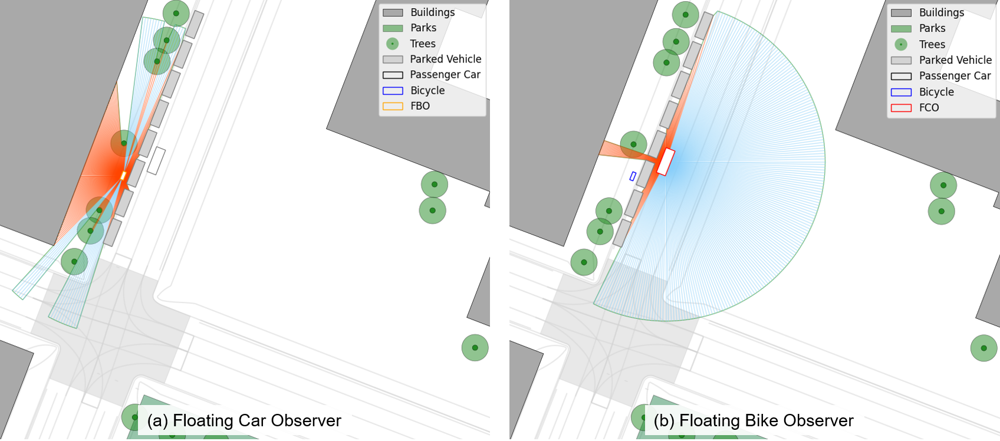

# FTO-Sim
*FTO-Sim* is an open-source simulation framework for Floating Traffic Observation (FTO). The FTO concept is adapted from the Floating Car Observer (FCO) method, that utilizes extended floating car data (xFCD) for traffic planning and traffic management purposes. Additionally, this simulation framework introduces further observer vehicle types, such as Floating Bike Observers (FBO).

For this, *FTO-Sim* is connected to a SUMO simulation and customized according to the user's needs. This ReadMe file serves as documentation for *FTO-Sim* and describes the single modules of the simulation framework as well as its customization and initialization.

## Table of Contents
1. [Citation](#citation)
2. [Features](#features)
3. [Installation / Prerequisites](#installation--prerequisites)
4. [Customization](#customization)
5. [Usage](#usage)

## Citation
When using *FTO-Sim*, please cite the following references:
* [Introduction of FTO-Sim](https://www.researchgate.net/publication/383272173_An_Open-Source_Framework_for_Evaluating_Cooperative_Perception_in_Urban_Areas) includes a detailed description of the general features of the simulation framework. Furthermore, a first application (visibility analysis) of the simulation framework is included to further calibrate the Level of Visibility (LoV) metric, originally introduced by [Pechinger et al.](https://www.researchgate.net/publication/372952261_THRESHOLD_ANALYSIS_OF_STATIC_AND_DYNAMIC_OCCLUSION_IN_URBAN_AREAS_A_CONNECTED_AUTOMATED_VEHICLE_PERSPECTIVE).

## Features
The following sub-chapters elaborate on the different modules and functionalities of the simulation framework, which are summarized in the figure below.


### Input Data

*FTO-Sim* makes use of three inut data types:
* [SUMO simulation](https://eclipse.dev/sumo/): SUMO and its interface TraCI (Traffic Control Interface) are used to retrieve the location of every static and dynamic road user for each time step of the simulation. Parked vehicles are considered static road users, while vehicular traffic, as well as VRUs (pedestrians and cyclists), are considered dynamic road users.
* [Open Streat Map (OSM)](https://www.openstreetmap.org/): Shapes and locations of static infrastructure elements, such as buildings, are retrieved from OSM. Furthermore, shapes and locations of urban greenery, such as parks and trees, are obtained from OSM.
* [GeoJSON](https://geojson.org/) (for visualizaton purposes only): If available, *FTO-Sim* makes use of GeoJSON files containing the road space distribution of the simulated scene to visualize vehicular carriageways, parking lots, bicycle lanes and pedestrian areas.

### Configuration Settings

*FTO-Sim* offers users a wide range of functionalities that can be individually configured before initializing the framework. This enables a customized use of the offered functionalities, dpending on the needs of individual users. The following configurations are available:
* The **general settings** enables users to activate the live visualization of the ray tracing procedure peformed by FCOs and FBOs. When the ray tracing visualization is activated, users can further choose if the generated rays themselves or only the resulting visibility polygon of FCOs and FBOs should be visualized. Additionally, a manual forwarding option is integrated, which, when activated, requests a user's input to proceed to the calculation of the next frame / simulation step. Furthermore, users can choose to save the animation after the simulation has been performed.
```
# General Settings

useLiveVisualization = True             # Live Visualization of Ray Tracing
visualizeRays = True                    # Visualize rays additionaly to the visibility polygon
useManualFrameForwarding = False        # Visualization of each frame, manual input necessary to forward the visualization
saveAnimation = True                    # Save the animation
```

* Through the **bounding box settings** users specify the entent of input data loading and the spatial boundaries of all further visualizations. The coordinates of the bounding box have to be provided in UTM format.
```
# Bounding Box Settings

north, south, east, west = 48.1505, 48.14905, 11.5720, 11.5669
bbox = (north, south, east, west)
```

* In the **path settings** users specify the location of the SUMO simulation's configuration file and, optionally, the location of the GeoJSON file used for the visualization of the road space distribution.
```
# Path Settings

base_dir = os.path.dirname(os.path.abspath(__file__))
parent_dir = os.path.dirname(base_dir)
sumo_config_path = os.path.join(parent_dir, 'SUMO_example', 'osm.sumocfg')              # Path to SUMO config-file
geojson_path = os.path.join(parent_dir, 'SUMO_example', 'TUM_CentralCampus.geojson')    # Path to GEOjson file
```

* The **warm-up settings** ensure an initial warm-up of the SUMO simulation to allow for the generation of a reasonable traffic demand within the simulated traffic network before activating the ray tracing method.
```
# Warm-Up Settings

delay = 90          #Warm-up time in seconds (during this time in the beginning of the simulation, no ray tracing is performed)
```

* In the **FCO / FBO settings** users define the penetration rates of both FCOs and FBOs individually. Every generated vehicle and / or bicycle in the SUMO simulation is assigned a random number of a uniform distribution ranging between [0, 1] and if this number os below the defined FCO / FBO penetration rate, the vehicle or bicycle is assigned the vehicle type 'floating car observer' or 'floating bike observer', respectively. Furthermore, the number of rays that a FCO / FBO will generate during the ray tracing can be defined.
```
# Warm-Up Settings

FCO_share = 0.1         # Penetration rate of floating car observers
FBO_share = 0.1         # Penetration rate of floating bike observers
numberOfRays = 360      # Number of rays generated for ray tracing
```

### Ray Tracing

Based on the provided input data and confiduration settings, *FTO-Sim* is initiated and performs the ray tracing method for every FCO and FBO.

Once the **simulation loop** is initiated, *FTO-Sim* will check the vehicle type of every road user within the previously defined bounding box for each time step of the simulation. After the initially defined warm-up phase and depending on the defined FCO / FBO penetration rates, vehicles or bicycles with the vehicle type 'floating car observer' or 'floating bike observer' will be randomly generated and thus activating the ray tracing.

The **ray tracing module** will generate the previously defined number of rays descending from every observer's center point up to a distance of 30 meters. The angle between the rays will be equivallently sized to generate a non-occluded field of view (FoV) in a circular form around the observer. Subsequently, the rays that intersect with static or dynamic objects are cut to obtain an observer's occluded FoV. Lastly, the endpoints of all rays are connected to create an observer's visibility polygon representing the area within an observer's total FoV.

The following figure shows a visualization of the ray tracing method, both for FCOs (left) and FBOs (right). The rays emerging from the centerpoint of an observer are colored in blue when they are inobstructed and in red when they intersect with objects.



### Applications

...

## Installation / Prerequisites

Create venv:
```
python -m venv venv
```

Initalizie / Activate venv:
```
.\venv\Scripts\activate
```

Installing required packages:
```
pip install -r requirements.txt
```

## Usage

How to rum the simulation framework (relate to customization for different 'use modes', e.g. Visualization, ManualForwarding, etc.)