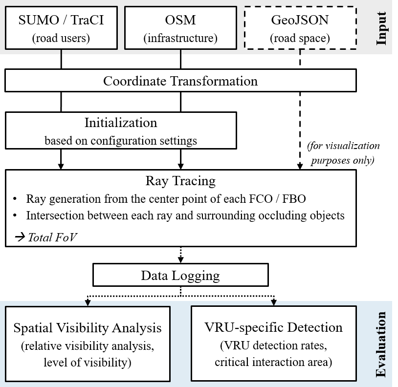

# FTO-Sim: An Open-Source Framework for Cooperative Perception Analysis

## Introduction

**FTO-Sim** is a comprehensive open-source simulation framework designed to analyze cooperative perception systems in urban environments through integration of microscopic traffic simulation and advanced ray tracing techniques. The framework enables researchers and practitioners to evaluate the visibility coverage and detection performance of Floating Traffic Observers (FTOs), including Floating Car Observers (FCOs) and Floating Bike Observers (FBOs), in various traffic scenarios.

The framework extends the traditional Floating Car Observer (FCO) concept, originally developed for traffic monitoring using extended Floating Car Data (xFCD), to incorporate multiple observer types and evaluate their effectiveness in detecting surrounding traffic, in particular vulnerable road users (VRUs). By combining SUMO traffic simulation with sophisticated occlusion modeling (see [Ray Tracing Methodology](#5-ray-tracing-methodology)), FTO-Sim provides detailed insights into the spatial and temporal characteristics of cooperative perception systems.

FTO-Sim addresses critical challenges in the deployment of cooperative intelligent transportation systems (C-ITS) by quantifying how physical occlusions from buildings, vegetation, parked vehicles (static occlusion) and other road users (dynamic occlusion) affect the field of view of observer vehicles. The framework's modular architecture (see [Framework Architecture](#framework-architecture)) supports multiple evaluation approaches, including [spatial visibility analysis](#7-spatial-visibility-analysis) for infrastructure-wide assessment and [VRU-specific detection metrics](#8-vru-specific-detection-analysis) for more targeted safety evaluation.

## About this Documentation

This documentation provides a complete guide to understanding, installing, configuring, and using the FTO-Sim framework. It is structured to serve both as a comprehensive reference for researchers seeking methodological details and as a practical manual for users implementing the framework in their own studies.

The documentation is organized to first cover essential information such as [citation requirements](#1-citation), [installation procedures](#2-installation-and-prerequisites), and basic [configuration](#3-configuration). Subsequently, it presents the [framework's architecture](#framework-architecture) and internal workflows, followed by in-depth explanations of the methodological foundations underlying the [ray tracing algorithm](#5-ray-tracing-methodology) and [evaluation metrics](#7-spatial-visibility-analysis). Finally, [simulation examples](#11-simulation-examples) that replicate previous work demonstrate how to apply FTO-Sim.

The [configuration](#3-configuration) and [usage](#4-usage) sections provide step-by-step instructions for framework operation, while methodological sections explain the scientific foundations and assumptions of implemented algorithms, which are described in more detail in the accompanying publications (see [Primary References](#11-primary-references)).

This documentation assumes basic familiarity with traffic simulation concepts and Python programming. Users should have a working knowledge of SUMO (Simulation of Urban MObility) and understand fundamental concepts of coordinate systems and spatial data processing.

---

## Framework Architecture

The FTO-Sim framework follows a modular workflow architecture designed to provide comprehensive cooperative perception analysis in urban environments. The following figure illustrates the sequential processing stages and data flow:



*Figure 1: Workflow of FTO-Sim*

The framework consists of six core modules that work together:

1. **Input Data Processing**: Integration of SUMO simulation data (dynamic road users via TraCI), OpenStreetMap infrastructure (buildings, trees, parks), and optional GeoJSON files (road space visualization).

2. **Coordinate Transformation**: Automated coordinate system conversions between SUMO's local coordinates, WGS84 geographic coordinates, and projected UTM systems for spatial consistency.

3. **Configuration & Initialization**: User-defined parameter setup including bounding box, penetration rates, ray tracing settings, and simulation warm-up. The framework initializes based on these settings (detailed in [Section 3: Configuration](#3-configuration)).

4. **Ray Tracing**: 360-degree ray generation around observer vehicles with intersection checks against static and dynamic objects to determine occlusion effects and final field of view (detailed in [Section 5: Ray Tracing Methodology](#5-ray-tracing-methodology)).

5. **Data Logging**: Real-time collection of simulation data into structured CSV files capturing trajectories, detections, conflicts, and spatial visibility (detailed in [Section 6: Data Collection and Logging](#6-data-collection-and-logging)).

6. **Evaluation Metrics**: Post-processing modules generating spatial visibility heat maps and VRU-specific detection analysis (detailed in [Section 7: Spatial Visibility Analysis](#7-spatial-visibility-analysis) and [Section 8: VRU-Specific Detection Analysis](#8-vru-specific-detection-analysis)).

The following sections provide detailed explanations of each module's methodological implementation, configuration options, and usage patterns.

---

## Table of Contents

1. [Citation](#1-citation)
   - 1.1 [Primary References](#11-primary-references)
   - 1.2 [Secondary References](#12-secondary-references)

2. [Installation and Prerequisites](#2-installation-and-prerequisites)
   - 2.1 [System Requirements](#21-system-requirements)
   - 2.2 [SUMO Installation](#22-sumo-installation)
   - 2.3 [Python Environment Setup](#23-python-environment-setup)
   - 2.4 [Creating a Virtual Environment](#24-creating-a-virtual-environment)
   - 2.5 [Activating the Virtual Environment](#25-activating-the-virtual-environment)
   - 2.6 [Installing Required Packages](#26-installing-required-packages)
   - 2.7 [Optional GPU Acceleration](#27-optional-gpu-acceleration)

3. [Configuration](#3-configuration)
   - 3.1 [Configuration File Overview](#31-configuration-file-overview)
   - 3.2 [Simulation Identification Settings](#32-simulation-identification-settings)
   - 3.3 [Performance Optimization Settings](#33-performance-optimization-settings)
   - 3.4 [Path Configuration](#34-path-configuration)
   - 3.5 [Geographic Bounding Box Settings](#35-geographic-bounding-box-settings)
   - 3.6 [Simulation Warm-up Settings](#36-simulation-warm-up-settings)
   - 3.7 [Observer Penetration Rate Settings](#37-observer-penetration-rate-settings)
   - 3.8 [Ray Tracing Parameter Settings](#38-ray-tracing-parameter-settings)
   - 3.9 [Visualization Settings](#39-visualization-settings)
   - 3.10 [Data Collection Settings](#310-data-collection-settings)
   - 3.11 [Advanced Configuration Options](#311-advanced-configuration-options)

4. [Usage](#4-usage)
   - 4.1 [Basic Workflow](#41-basic-workflow)
   - 4.2 [Simulation Mode](#42-simulation-mode)
   - 4.3 [Visualization Mode](#43-visualization-mode)
   - 4.4 [Debugging Mode](#44-debugging-mode)
   - 4.5 [Saving Mode](#45-saving-mode)
   - 4.6 [Running Evaluation Scripts](#46-running-evaluation-scripts)
   - 4.7 [Common Workflows and Use Cases](#47-common-workflows-and-use-cases)

5. [Ray Tracing Methodology](#5-ray-tracing-methodology)
   - 5.1 [Theoretical Foundation](#51-theoretical-foundation)
   - 5.2 [Initialization and Binning Map Setup](#52-initialization-and-binning-map-setup)
   - 5.3 [Observer Assignment Process](#53-observer-assignment-process)
   - 5.4 [Ray Generation and Distribution](#54-ray-generation-and-distribution)
   - 5.5 [Occlusion Detection Algorithm](#55-occlusion-detection-algorithm)
   - 5.6 [Ray Intersection Calculations](#56-ray-intersection-calculations)
   - 5.7 [Visibility Polygon Construction](#57-visibility-polygon-construction)
   - 5.8 [Performance Optimization Strategies](#58-performance-optimization-strategies)
   - 5.9 [Visualization Capabilities](#59-visualization-capabilities)

6. [Data Collection and Logging](#6-data-collection-and-logging)
   - 6.1 [Data Logging Architecture](#61-data-logging-architecture)
   - 6.2 [Output Directory Structure](#62-output-directory-structure)
   - 6.3 [Core Simulation Logs](#63-core-simulation-logs)
   - 6.4 [Spatial Visibility Data](#64-spatial-visibility-data)
   - 6.5 [Real-Time Data Collection Process](#65-real-time-data-collection-process)
   - 6.6 [Data Integrity and Validation](#66-data-integrity-and-validation)
   - 6.7 [Performance Considerations](#67-performance-considerations)

7. [Spatial Visibility Analysis](#7-spatial-visibility-analysis)
   - 7.1 [Conceptual Foundation](#71-conceptual-foundation)
   - 7.2 [Methodology Overview](#72-methodology-overview)
   - 7.3 [Relative Visibility Metric](#73-relative-visibility-metric)
   - 7.4 [Level of Visibility (LoV) Metric](#74-level-of-visibility-lov-metric)
   - 7.5 [LoV Classification Methodology](#75-lov-classification-methodology)
   - 7.6 [Heatmap Generation and Visualization](#76-heatmap-generation-and-visualization)
   - 7.7 [Interpretation Guidelines](#77-interpretation-guidelines)
   - 7.8 [Limitations and Considerations](#78-limitations-and-considerations)
   - 7.9 [Running Spatial Visibility Evaluation](#79-running-spatial-visibility-evaluation)

8. [VRU-Specific Detection Analysis](#8-vru-specific-detection-analysis)
   - 8.1 [Motivation and Objective](#81-motivation-and-objective)
   - 8.2 [Detection Event Tracking](#82-detection-event-tracking)
   - 8.3 [Spatio-Temporal Detection Rates](#83-spatio-temporal-detection-rates)
   - 8.4 [Critical Interaction Areas](#84-critical-interaction-areas)
   - 8.5 [Multi-Level Aggregation](#85-multi-level-aggregation)
   - 8.6 [Trajectory Visualization](#86-trajectory-visualization)
   - 8.7 [Defining Critical Areas in SUMO](#87-defining-critical-areas-in-sumo)
   - 8.8 [Interpretation and Application](#88-interpretation-and-application)
   - 8.9 [Running VRU-Specific Detection Evaluation](#89-running-vru-specific-detection-evaluation)

9. [Conflict Analysis and Safety Metrics](#9-conflict-analysis-and-safety-metrics)
    - 9.1 [SUMO Surrogate Safety Measures](#91-sumo-surrogate-safety-measures)
    - 9.2 [Time-to-Collision (TTC)](#92-time-to-collision-ttc)
    - 9.3 [Post-Encroachment Time (PET)](#93-post-encroachment-time-pet)
    - 9.4 [Deceleration Rate to Avoid Crash (DRAC)](#94-deceleration-rate-to-avoid-crash-drac)
    - 9.5 [Integration with Detection Data](#95-integration-with-detection-data)
    - 9.6 [Limitations of Conflict Detection](#96-limitations-of-conflict-detection)

10. [Advanced Topics](#10-advanced-topics)
    - 10.1 [Custom Observer Types](#101-custom-observer-types)
    - 10.2 [Extending Evaluation Metrics](#102-extending-evaluation-metrics)
    - 10.3 [Large-Scale Simulations](#103-large-scale-simulations)
    - 10.4 [Integration with External Tools](#104-integration-with-external-tools)
    - 10.5 [Parameter Sensitivity Analysis](#105-parameter-sensitivity-analysis)

11. [Simulation Examples](#11-simulation-examples)
    - 11.1 [Overview of Included Examples](#111-overview-of-included-examples)
    - 11.2 [Example 1: Spatial Visibility Analysis (Ilic et al., TRB 2025)](#112-example-1-spatial-visibility-analysis-ilic-et-al-trb-2025)
    - 11.3 [Example 2: VRU-Specific Detection (Ilic et al., TRA 2026)](#113-example-2-vru-specific-detection-ilic-et-al-tra-2026)
    - 11.4 [Creating Custom Simulation Scenarios](#114-creating-custom-simulation-scenarios)
    - 11.5 [Best Practices for Scenario Development](#115-best-practices-for-scenario-development)

12. [Troubleshooting and FAQ](#12-troubleshooting-and-faq)
    - 12.1 [Common Installation Issues](#121-common-installation-issues)
    - 12.2 [SUMO Integration Problems](#122-sumo-integration-problems)
    - 12.3 [Performance Issues](#123-performance-issues)
    - 12.4 [Visualization Problems](#124-visualization-problems)
    - 12.5 [Data Output Issues](#125-data-output-issues)

13. [Contributing and Development](#13-contributing-and-development)
    - 13.1 [Contributing Guidelines](#131-contributing-guidelines)
    - 13.2 [Code Structure](#132-code-structure)
    - 13.3 [Testing](#133-testing)
    - 13.4 [Documentation Standards](#134-documentation-standards)

14. [License and Acknowledgments](#14-license-and-acknowledgments)
    - 14.1 [License Information](#141-license-information)
    - 14.2 [Acknowledgments](#142-acknowledgments)
    - 14.3 [Third-Party Dependencies](#143-third-party-dependencies)

---

## 1. Citation

When using FTO-Sim in your research, please cite the appropriate references to acknowledge the framework's development and methodological foundations.

### 1.1 Primary References

The following publications present different versions of the FTO-Sim framework and provide detailed methodological explanations of the implemented algorithms, theoretical foundations, and evaluation metrics.

#### ETRR Journal Paper (FTO-Sim Version 2)

* **Ilic, M., et al.** (2025). "FTO-Sim: An Open-Source Framework for Evaluating Cooperative Perception in Urban Areas." *European Transport Research Review*. *(Under review after first revisions)*

This paper presents the current version of FTO-Sim (Version 2) with comprehensive methodological foundations and explanations of all implemented evaluation metrics. The framework now includes both *spatial visibility analysis* and *VRU-specific detection* metrics for comprehensive assessment of cooperative perception systems. Furthermore, the paper introduces ready-to-use simulation examples included in the FTO-Sim repository, enabling rapid application of the framework for other researchers and practitioners.

#### TRB 2025 Conference Paper (FTO-Sim Version 1)

* [**Ilic, M., et al.**](https://www.researchgate.net/publication/383272173_An_Open-Source_Framework_for_Evaluating_Cooperative_Perception_in_Urban_Areas) (2025). "An Open-Source Framework for Evaluating Cooperative Perception in Urban Areas." *Transportation Research Board 104th Annual Meeting*, Washington D.C., USA.

This paper introduces the initial version of FTO-Sim (Version 1) with the first implementation of spatial visibility analysis metrics. It presents the foundational occlusion modeling approach and demonstrates the framework's capability for analyzing relative visibility patterns and the Level of Visibility (LoV) metric, originally introduced by [Pechinger et al.](https://www.researchgate.net/publication/372952261_THRESHOLD_ANALYSIS_OF_STATIC_AND_DYNAMIC_OCCLUSION_IN_URBAN_AREAS_A_CONNECTED_AUTOMATED_VEHICLE_PERSPECTIVE) Through a small case study focused on a single intersection, the paper identifies opportunities for further calibration and refinement of the LoV metric.

### 1.2 Secondary References

The following publications demonstrate the application of FTO-Sim to specific case studies and research questions, showcasing the framework's capabilities in various traffic scenarios and evaluation contexts.

#### TRA 2026 Conference Paper

* **Ilic, M., et al.** (2026). "Evaluating VRU Detection Performance in Urban Environments using Cooperative Perception." *Transport Research Arena (TRA) 2026*, Budapest, Hungary. *(01.-04.06.26, accepted for oral presentation, publication of proceedings pending)*

This paper applies FTO-Sim's VRU-specific detection metrics to evaluate the effectiveness of cooperative perception systems in detecting vulnerable road users. Through a comparative case study examining different speed limit scenarios (30 km/h vs. 50 km/h), the paper demonstrates how infrastructure design and traffic management measures influence detection rates in critical interaction areas. The study showcases the framework's capability to assess spatio-temporal detection performance at multiple aggregation levels.

---

## 2. Installation and Prerequisites

This section guides you through setting up FTO-Sim on your system, from installing prerequisites to verifying a successful installation. The framework requires SUMO for traffic simulation, Python 3.10 or higher, and various geospatial and scientific computing libraries.

### 2.1 System Requirements

FTO-Sim has been developed and tested on Windows and Linux, but should also work on macOS systems with appropriate modifications to path handling and virtual environment activation commands.

**Minimum Requirements:**
- **Operating System**: Windows 10/11, Linux (Ubuntu 20.04+), or macOS (10.15+)
- **Python**: Version 3.10 or higher (3.11 recommended)
- **RAM**: 8 GB minimum, 16 GB recommended for larger scenarios
- **Storage**: 2 GB for installation, additional space for simulation outputs
- **SUMO**: Version 1.20.0 or higher

**Recommended for Optimal Performance:**
- **RAM**: 32 GB or more for large-scale simulations
- **CPU**: Multi-core processor (8+ cores) for parallel ray tracing
- **GPU** (optional): NVIDIA GPU with CUDA support for GPU-accelerated computations
- **Storage**: SSD for faster data I/O operations

**Software Dependencies:**
- Git (for cloning the repository)
- SUMO (Simulation of Urban MObility) traffic simulator
- Python package manager (pip)
- FFmpeg (optional, for video generation from ray tracing visualizations)

### 2.2 SUMO Installation

FTO-Sim requires SUMO (Simulation of Urban MObility) to be installed on your system. SUMO provides the microscopic traffic simulation capabilities and TraCI interface that FTO-Sim uses to retrieve vehicle positions and dynamics.

**Installation Steps:**

1. **Download SUMO**: Visit the [official SUMO download page](https://sumo.dlr.de/docs/Downloads.php) and download the appropriate installer for your operating system.

2. **Install SUMO**: Follow the installation instructions for your platform:
   - **Windows**: Run the installer executable and follow the setup wizard
   - **Linux**: Use package managers or build from source following the [Linux installation guide](https://sumo.dlr.de/docs/Installing/index.html#linux)
   - **macOS**: Use Homebrew (`brew install sumo`) or follow the [macOS installation guide](https://sumo.dlr.de/docs/Installing/index.html#macos)

3. **Verify SUMO Installation**: Open a terminal/command prompt and verify the installation:
   ```bash
   sumo --version
   ```
   This should display the installed SUMO version (1.20.0 or higher required).

**Note**: FTO-Sim uses the `libsumo`, `traci`, and `sumolib` Python packages (included in `requirements.txt`) which are automatically installed in the next steps. These packages must match your installed SUMO version.

### 2.3 Python Environment Setup

FTO-Sim requires Python 3.10 or higher. The use of Python 3.11 is recommended for optimal compatibility with all dependencies.

**Check your Python version:**
```bash
python --version
```

### 2.4 Creating a Virtual Environment

It is strongly recommended to create an isolated virtual environment for FTO-Sim. This approach prevents conflicts with other Python projects and ensures that FTO-Sim's dependencies are properly isolated.

**Creating the Virtual Environment:**

Navigate to the FTO-Sim root directory and execute:

```bash
python -m venv venv
```

This creates a directory called `venv` in your current location. You only need to perform this step once during initial setup.

**Alternative Virtual Environment Tools:**

While this documentation uses Python's built-in `venv` module, you may alternatively use:
- **conda**: `conda create -n fto-sim python=3.11`
- **virtualenv**: `virtualenv venv`

### 2.5 Activating the Virtual Environment

After creating the virtual environment, you must activate it before installing packages or running FTO-Sim. This step must be performed every time you open a new terminal session.

**Activation Commands:**

- **Windows (PowerShell)**:
  ```powershell
  .\venv\Scripts\Activate.ps1
  ```

- **Windows (Command Prompt)**:
  ```cmd
  .\venv\Scripts\activate.bat
  ```

- **Linux/macOS**:
  ```bash
  source venv/bin/activate
  ```

**PowerShell Execution Policy Issue:**

If you encounter an error when activating the virtual environment on Windows PowerShell, it is likely due to the system's execution policy, which prevents script execution for security reasons. To resolve this:

```powershell
Set-ExecutionPolicy -ExecutionPolicy RemoteSigned -Scope CurrentUser
```

After running this command, try activating the virtual environment again.

**Verification:**

When the virtual environment is activated, your terminal prompt will be prefixed with `(venv)`:
```
(venv) C:\FTO-Sim>
```

### 2.6 Installing Required Packages

With the virtual environment activated, install all required Python packages using the provided `requirements.txt` file. This file contains all necessary dependencies with their tested versions.

**Installation Command:**

```bash
pip install -r requirements.txt
```

This will install all required packages including:

**Core Simulation:**
- libsumo, traci, sumolib (SUMO Python interfaces)
- SumoNetVis (SUMO network visualization)

**Scientific Computing:**
- numpy, pandas, scipy (numerical and data processing)

**Geospatial Analysis:**
- geopandas, shapely, pyproj (geospatial data handling)
- osmnx (OpenStreetMap data processing)
- Rtree, pyogrio (spatial indexing and I/O)

**Visualization:**
- matplotlib, seaborn (plotting and visualization)
- pillow, imageio (image and video processing)

**Supporting Libraries:**
- networkx (graph analysis)
- lxml, beautifulsoup4 (XML/HTML parsing)
- tqdm (progress bars)
- psutil (system monitoring)

**Installation Time:**

The complete installation may take 5-15 minutes depending on your internet connection and system performance, as some packages (particularly geospatial libraries) require compilation or download of binary wheels.

**Package Manager Recommendations:**

For Windows users, we recommend using `pip` with pre-compiled wheels. For Linux users, some geospatial packages may require system-level dependencies:

```bash
sudo apt-get install libspatialindex-dev libgdal-dev
```

### 2.7 Optional GPU Acceleration

FTO-Sim supports GPU acceleration for ray tracing operations, which can significantly improve performance for large-scale simulations. GPU acceleration is optional and requires an NVIDIA GPU with CUDA support.

**Prerequisites for GPU Acceleration:**

1. **NVIDIA GPU**: CUDA-capable GPU (Compute Capability 3.5 or higher)
2. **CUDA Toolkit**: CUDA 11.x or 12.x installed on your system
3. **GPU Driver**: Recent NVIDIA driver (version 450.0 or higher)

**Installing GPU Support:**

Uncomment and install the appropriate CuPy version in `requirements.txt`, or install manually:

**For CUDA 11.x:**
```bash
pip install cupy-cuda11x
```

**For CUDA 12.x:**
```bash
pip install cupy-cuda12x
```

**Optional JIT Compilation (Numba):**

For additional performance optimization, install Numba for just-in-time compilation:

```bash
pip install numba
```

**Verification:**

After installation, FTO-Sim will automatically detect GPU availability and display this information when you run the main script:

```
✅ GPU acceleration available: NVIDIA GeForce RTX 3080 (10.0 GB)
```

**Fallback Behavior:**

If GPU acceleration is not available or CuPy is not installed, FTO-Sim will automatically fall back to CPU-based computation without affecting functionality. The framework uses detection logic to gracefully handle missing optional dependencies.

**Note**: GPU acceleration is most beneficial for simulations with high observer penetration rates and large numbers of rays. For small scenarios, the overhead of GPU memory transfers may not provide significant speedup compared to multi-threaded CPU execution.

---

## 3. Configuration

FTO-Sim offers extensive configuration options to customize simulations according to specific research needs and system capabilities. All configuration for the main simulation process is performed by editing parameters in the configuration section of [`scripts/main.py`](scripts/main.py). This centralized approach ensures that all settings are clearly documented and easily accessible in one location.

### 3.1 Configuration File Overview

The configuration section is clearly marked in [`scripts/main.py`](scripts/main.py) and organized into logical groups:

```python
# =====================================================================================
# CONFIGURATION
# =====================================================================================
```

**Configuration Structure:**

1. **General Settings**: Simulation identification, performance optimization, file paths, geographic boundaries, and simulation warm-up
2. **Ray Tracing Settings**: Observer penetration rates, ray parameters, and sensor accuracy
3. **Data Collection & Analysis Settings**: Logging options and analysis parameters

**Important Notes:**

- All file paths in configuration use `os.path.join()` for cross-platform compatibility
- The configuration section includes commented examples from published simulation scenarios
- Parameter changes take effect when [`main.py`](scripts/main.py) is executed
- Invalid parameter values trigger validation errors before simulation starts

### 3.2 Simulation Identification Settings

The file tag distinguishes different simulation runs and determines output directory naming.

```python
# Simulation Identification Settings:
# ──────────────────────────────────────────────────────────────────────────────────
# Change this tag to distinguish different simulation runs with e.g. same configuration
file_tag = 'MyProject_high-demand_seed420' # simulation identifier
```

**Output Directory Naming Convention:**

Simulation outputs are automatically organized into directories following the pattern:
```
outputs/{file_tag}_FCO{X}%_FBO{Y}%/
```

Where:
- `{file_tag}`: User-defined identifier from this configuration setting
- `{X}`: FCO penetration rate percentage (e.g., 10 for 10%)
- `{Y}`: FBO penetration rate percentage (e.g., 0 for 0%)

**Use Cases:**

- Distinguish different projects (e.g. different case studies)
- Label different conditions (e.g., 'status_quo', 'speed_reduction', 'removal_of_on-street_parking')
- Track multiple replications with different random seeds

### 3.3 Performance Optimization Settings

FTO-Sim supports three performance optimization levels that balance computation speed with system compatibility.

```python
# Performance Optimization Settings:
# ──────────────────────────────────────────────────────────────────────────────────
# Choose performance optimization level based on your system capabilities:
# - "none": Single-threaded processing (most compatible, but slower)
# - "cpu": Multi-threaded CPU processing (recommended default, good balance)
# - "gpu": CPU multi-threading + GPU acceleration (fastest, requires NVIDIA GPU with CUDA/CuPy)
performance_optimization_level = "gpu"
max_worker_threads = None  # None = auto-detect optimal thread count, or specify number (e.g., 4, 8)
```

**Optimization Level Details:**

| Level | Threading | GPU | Best For | Thread Count |
|-------|-----------|-----|----------|--------------|
| `"none"` | Single-threaded | No | Small scenarios, debugging, maximum compatibility | 1 |
| `"cpu"` | Multi-threaded | No | Most scenarios, recommended default | Auto-detect (max 8) |
| `"gpu"` | Multi-threaded | Yes | Large scenarios with high observer counts | Auto-detect (max 16) |

**Thread Count Configuration:**

- `max_worker_threads = None`: Automatically detects optimal thread count based on optimization level
- `max_worker_threads = 4`: Explicitly sets 4 worker threads
- `max_worker_threads = 8`: Explicitly sets 8 worker threads (recommended for most systems)

**System Requirements by Optimization Level:**

- `"none"`: Any system with Python 3.10+
- `"cpu"`: Multi-core processor (4+ cores recommended)
- `"gpu"`: NVIDIA GPU with CUDA support, CuPy installed (see [Section 2.7](#27-optional-gpu-acceleration))

### 3.4 Path Configuration

Specify paths to SUMO configuration files and optional GeoJSON visualizations.

```python
# Path Settings:
# ──────────────────────────────────────────────────────────────────────────────────
base_dir = os.path.dirname(os.path.abspath(__file__))
parent_dir = os.path.dirname(base_dir)

# Path to SUMO config-file
sumo_config_path = os.path.join(parent_dir, 'simulation_examples', 'Spatial-Visibility_Ilic-TRB-2025', 'Ilic-2025_config_low-demand.sumocfg')

# Path to GeoJSON file (optional)
geojson_path = os.path.join(parent_dir, 'simulation_examples', 'Spatial-Visibility_Ilic-TRB-2025', 'Ilic-2025.geojson')
```

**SUMO Configuration File:**

The SUMO configuration file (`.sumocfg`) specifies:
- Network file (`.net.xml`)
- Route/demand files (`.rou.xml`)
- Additional files (`.add.xml`) containing parking lots, traffic signals, and critical interaction areas
- Simulation parameters (time step, begin/end time, etc.)

**GeoJSON File (Optional):**

GeoJSON files provide road space allocation visualization:
- Enhances understanding of simulated environment
- Shows bicycle infrastructure, sidewalks, vehicle lanes and on-street parking lots
- Overlayed on visualization if `useLiveVisualization = True`
- Not required for simulation execution

### 3.5 Geographic Bounding Box Settings

Define the geographic area for loading OpenStreetMap data and determining simulation extent.

```python
# Geographic Bounding Box Settings:
# ──────────────────────────────────────────────────────────────────────────────────
# Geographic boundaries in longitude / latitude in EPSG:4326 (WGS84)
north, south, east, west = 48.150500, 48.149050, 11.571000, 11.567900
bbox = (north, south, east, west)

# OSM Feature Toggles (enable/disable loading from OpenStreetMap)
# Set to True to load the corresponding layer; False to skip loading entirely
LoadOSM_Buildings   = True
LoadOSM_Parks       = True
LoadOSM_Trees       = True
LoadOSM_Barriers    = True
LoadOSM_PT_Shelters = True
```

**Bounding Box Specification:**

- **Coordinate System**: WGS84 (EPSG:4326) in decimal degrees
- **Format**: `(north, south, east, west)` corresponding to `(max_lat, min_lat, max_lon, min_lon)`
- **Purpose**: Defines area from which OpenStreetMap features are loaded as static occlusion objects

**Determining Bounding Box:**

1. **From OpenStreetMap**: Use [bboxfinder.com](http://bboxfinder.com/) or similar tools based on study area extent
2. **From Coordinates**: Manually specify based on study area extent

**OSM Feature Toggles:**

Selectively enable OpenStreetMap features to optimize performance and simulation scope:

- `LoadOSM_Buildings`: Buildings as static occlusion objects (recommended: `True`)
- `LoadOSM_Parks`: Park boundaries and green spaces (optional, only for visualization purposes)
- `LoadOSM_Trees`: Individual trees and tree rows, tree stems as static occlusion objects, tree canopies only for visualization purposes (recommended: `True`)
- `LoadOSM_Barriers`: Walls, fences, and barriers (optional, if available in study area)
- `LoadOSM_PT_Shelters`: Public transport shelters (optional, if available in study area)

### 3.6 Simulation Warm-up Settings

Configure the warm-up period during which vehicles populate the network but ray tracing is not performed.

```python
# Simulation Warm-up Settings:
# ──────────────────────────────────────────────────────────────────────────────────
delay = 180 # Warm-up time in seconds (no ray tracing during this period)
```

**Purpose of Warm-up Period:**

- Allows traffic flow to stabilize before data collection begins
- Ensures realistic vehicle distribution and queue formation
- Prevents edge effects from empty network initialization

**Considerations:**

- Set `delay = 0` for scenarios that start with pre-loaded traffic state
- Longer warm-up periods improve realism but increase total simulation time
- Monitor SUMO GUI during warm-up to verify adequate network loading
- Warm-up time does not affect observer assignment (assigned after warm-up)

### 3.7 Observer Penetration Rate Settings

Define the proportion of vehicles and bicycles assigned as floating observers.

```python
# Observer Penetration Rate Settings:
# ──────────────────────────────────────────────────────────────────────────────────
FCO_share = 0.1 # Floating Car Observers penetration rate (0.0 to 1.0)
FBO_share = 0.0  # Floating Bike Observers penetration rate (0.0 to 1.0)
```

**Penetration Rate Specification:**

- **Range**: `0.0` (0%) to `1.0` (100%)
- **FCO_share**: Proportion of passenger cars assigned as Floating Car Observers
- **FBO_share**: Proportion of bicycles assigned as Floating Bike Observers
- **Assignment**: Probabilistic assignment using fixed random seed for reproducibility

**Observer Assignment Process:**

1. Each vehicle/bicycle receives a random number from uniform distribution [0, 1]
2. If random number < penetration rate, vehicle becomes observer
3. Fixed random seed ensures reproducibility across runs
4. Assignment occurs after warm-up period

**Computational Impact:**

Higher penetration rates increase:
- Number of ray tracing operations per timestep
- Memory usage for visibility polygon storage
- Total simulation runtime

### 3.8 Ray Tracing Parameter Settings

Configure ray generation parameters that determine the resolution and extent of visibility calculations.

```python
# Ray Tracing Parameter Settings:
# ──────────────────────────────────────────────────────────────────────────────────
numberOfRays = 360  # Number of rays emerging from each observer vehicle
radius = 30         # Ray radius in meters
grid_size = 1.0     # Grid size for visibility heat map (meters) - determines the resolution of LoV and RelVis heatmaps
```

**Number of Rays (`numberOfRays`):**

- **Default**: `360` rays (1° angular resolution)
- **Trade-off**: More rays increase accuracy but also computational cost
- **Angular resolution**: `360 / numberOfRays` degrees between rays

| numberOfRays | Angular Resolution | Use Case |
|--------------|-------------------|----------|
| 36 | 10° | Quick tests, coarse approximation |
| 180 | 2° | Moderate accuracy, faster computation |
| 360 | 1° | Standard accuracy (recommended) |
| 720 | 0.5° | High precision, detailed analysis |

**Ray Radius (`radius`):**

- **Default**: `30` meters
- **Interpretation**: Detection range from observer center point
- **Considerations**:
  - Sensor technology capabilities (LiDAR, camera, radar)

**Grid Size (`grid_size`):**

- **Default**: `1.0` meters (high resolution)
- **Purpose**: Determines spatial resolution of visibility counting and heatmap generation
- **Impact**:
  - Smaller values: Finer resolution, higher computational/memory cost
  - Larger values: Coarser resolution, faster processing, smaller output files

**Sensor Accuracy Settings:**

```python
# Sensor Accuracy Settings:
# ──────────────────────────────────────────────────────────────────────────────────
# Single sensor accuracy for continuous visibility counts (affects probability calculations)
# Valid values: 60, 70, 80, or 90 (representing 60%, 70%, 80%, or 90% accuracy)
single_sensor_accuracy = 70  # Single observer detection accuracy percentage
```

**Sensor Accuracy Model:**

The sensor accuracy setting models the probability that a single observer correctly detects and classifies an object within its field of view (single observer perception pipeline). When multiple observers simultaneously view the same location, the combined detection probability (multi-observer perception pipeline) increases according to:

**Lookup Table (Built into Framework):**

| Single Accuracy | 1 Observer | 2 Observers | 3 Observers | 4 Observers | 5+ Observers |
|----------------|-----------|-------------|-------------|-------------|-------------|
| 60% | 0.60 | 0.84 | 0.94 | 0.97 | 0.99 |
| 70% | 0.70 | 0.91 | 0.97 | 0.99 | 1.00 |
| 80% | 0.80 | 0.96 | 0.99 | 1.00 | 1.00 |
| 90% | 0.90 | 0.99 | 1.00 | 1.00 | 1.00 |

This probabilistic model is used internally for continuous visibility value calculations in spatial visibility analysis.

### 3.9 Visualization Settings

Control real-time visualization, animation saving, and debugging display options.

```python
# Visualization Settings:
# ──────────────────────────────────────────────────────────────────────────────────
useLiveVisualization = False      # Show live visualization during simulation
visualizeRays = False             # Show individual rays in visualization (besides resulting visibility polygon)
useManualFrameForwarding = False  # Manual frame-by-frame progression (for debugging)
saveAnimation = False             # Save animation as video file
```

**Live Visualization (`useLiveVisualization`):**

- **`True`**: Opens real-time visualization window showing ray tracing in action
- **`False`**: Runs simulation in headless mode (faster, recommended for production runs)
- **Use cases**: Debugging, presentations, verification of scene setup

**Visualize Rays (`visualizeRays`):**

- **`True`**: Displays individual rays in addition to visibility polygon
  - Blue rays: Unobstructed rays reaching maximum radius
  - Red rays: Occluded rays intersecting with objects
- **`False`**: Shows only the final visibility polygon (cleaner visualization)

**Manual Frame Forwarding (`useManualFrameForwarding`):**

- **`True`**: Pauses after each frame; press Enter to advance
- **`False`**: Continuous forwarding at simulation speed
- **Use cases**: Debugging, detailed inspection of specific scenarios, screenshot capture

**Save Animation (`saveAnimation`):**

- **`True`**: Records visualization and saves as MP4 video file
- **`False`**: No recording (reduces memory usage and disk I/O)
- **Output location**: `outputs/{scenario}/out_raytracing/ray_tracing_animation_FCO{X}%_FBO{Y}%.mp4`
- **Requirements**: FFmpeg must be available on system PATH

**Visualization Compatibility:**

⚠️ **Important**: `useLiveVisualization = True` and `saveAnimation = True` are **mutually exclusive**. Choose one:

- **For live display**: `useLiveVisualization = True`, `saveAnimation = False`
- **For video export**: `useLiveVisualization = False`, `saveAnimation = True`

**Performance Impact of Visualization:**

Enabling visualization significantly increases simulation time:
- Live visualization: 5-10x slower than headless mode
- Animation saving: 3-5x slower than headless mode
- Manual frame forwarding: Dependent on user input speed

For production runs analyzing multiple scenarios, disable all visualization options.

### 3.10 Data Collection Settings

Configure which data streams are collected during simulation to optimize performance.

```python
# Data Collection Settings:
# ──────────────────────────────────────────────────────────────────────────────────
basic_gap_bridge = 10        # Gap bridging for trajectory smoothing
basic_segment_length = 3     # Minimum segment length for trajectories

# Logging Configuration (Performance Tuning):
# ──────────────────────────────────────────────────────────────────────────────────
# Control which data is collected during simulation to optimize performance.
# Disabling unused logs can significantly reduce computation time and memory usage.
COLLECT_DETECTION_LOGS = True           # Required by evaluation scripts (keep enabled)
COLLECT_BICYCLE_TRAJECTORIES = True     # Required by evaluation scripts (keep enabled)
COLLECT_VEHICLE_TRAJECTORIES = False    # Disabled by default - saves ~40-50% time (only needed for observer visualization)
COLLECT_CONFLICT_DATA = True            # Disabled by default - only enable for safety analysis
COLLECT_FLEET_COMPOSITION = False       # Disabled by default - not used by any evaluation script
COLLECT_TRAFFIC_LIGHT_DATA = True       # Disabled by default - not used by any evaluation script
```

**Trajectory Smoothing Parameters:**

- **`basic_gap_bridge`**: Maximum gap (in meters) to bridge in trajectories
  - Connects trajectory segments separated by small gaps
  - Typical value: 10 timesteps for 10 Hz simulation resolution (1 second)
  
- **`basic_segment_length`**: Minimum trajectory segment length (in timesteps)
  - Filters out very shortly detected trajectory fragments
  - Typical value: 3 timesteps for 10 Hz simulation resolution (0.3 seconds)

**Logging Flags: Performance Optimization:**

Each logging flag controls whether specific data is collected. Disabling unused logs significantly improves performance:

| Flag | Required By | Performance Impact | Recommendation |
|------|-------------|-------------------|----------------|
| `COLLECT_DETECTION_LOGS` | VRU-specific detection evaluation | Moderate | ✓ Always enable |
| `COLLECT_BICYCLE_TRAJECTORIES` | VRU-specific detection evaluation | Moderate | ✓ Always enable |
| `COLLECT_VEHICLE_TRAJECTORIES` | Observer trajectory visualization | **High** (~40-50% overhead) | ⚠️ Disable unless needed |
| `COLLECT_CONFLICT_DATA` | VRU-specific detection evaluation (conflict detection rate) | High | ⚠️ Enable only for conflict studies |
| `COLLECT_FLEET_COMPOSITION` | None (informational only) | Low | ⚠️ Disable (rarely needed) |
| `COLLECT_TRAFFIC_LIGHT_DATA` | VRU-specific detection evaluation (bicycle trajectory plotting) | Moderate | ⚠️ Enable only when visualization of bicycle detection plots is needed |

### 3.11 Advanced Configuration Options

To implement custom sensor accuracy probabilities:

1. Add new accuracy level to `SENSOR_ACCURACY_VALUES` dictionary
2. Define probability values for 1-5 simultaneous observers
3. Set `single_sensor_accuracy` to new value

Example for 95% single sensor accuracy:
```python
SENSOR_ACCURACY_VALUES = {
    60: {1: 0.6, 2: 0.84, 3: 0.94, 4: 0.97, 5: 0.99},
    70: {1: 0.7, 2: 0.91, 3: 0.97, 4: 0.99, 5: 1.0},
    80: {1: 0.8, 2: 0.96, 3: 0.99, 4: 1.0, 5: 1.0},
    90: {1: 0.9, 2: 0.99, 3: 1.0, 4: 1.0, 5: 1.0},
    95: {1: 0.95, 2: 0.9975, 3: 0.999875, 4: 1.0, 5: 1.0}  # Custom 95% accuracy
}
single_sensor_accuracy = 95
```
---

## 4. Usage

### 4.1 Basic Workflow

### 4.2 Simulation Mode

### 4.3 Visualization Mode

### 4.4 Debugging Mode

### 4.5 Saving Mode

### 4.6 Running Evaluation Scripts

### 4.7 Common Workflows and Use Cases

---

## 5. Ray Tracing Methodology

### 5.1 Theoretical Foundation

### 5.2 Initialization and Binning Map Setup

### 5.3 Observer Assignment Process

### 5.4 Ray Generation and Distribution

### 5.5 Occlusion Detection Algorithm

### 5.6 Ray Intersection Calculations

### 5.7 Visibility Polygon Construction

### 5.8 Performance Optimization Strategies

### 5.9 Visualization Capabilities

---

## 6. Data Collection and Logging

### 6.1 Data Logging Architecture

### 6.2 Output Directory Structure

### 6.3 Core Simulation Logs

### 6.4 Spatial Visibility Data

### 6.5 Real-Time Data Collection Process

### 6.6 Data Integrity and Validation

### 6.7 Performance Considerations

---

## 7. Spatial Visibility Analysis

### 7.1 Conceptual Foundation

### 7.2 Methodology Overview

### 7.3 Relative Visibility Metric

### 7.4 Level of Visibility (LoV) Metric

### 7.5 LoV Classification Methodology

### 7.6 Heatmap Generation and Visualization

### 7.7 Interpretation Guidelines

### 7.8 Limitations and Considerations

### 7.9 Running Spatial Visibility Evaluation

---

## 8. VRU-Specific Detection Analysis

### 8.1 Motivation and Objective

### 8.2 Detection Event Tracking

### 8.3 Spatio-Temporal Detection Rates

### 9.4 Critical Interaction Areas

### 8.5 Multi-Level Aggregation

### 8.6 Trajectory Visualization

### 8.7 Defining Critical Areas in SUMO

### 8.8 Interpretation and Application

### 8.9 Running VRU-Specific Detection Evaluation

---

## 9. Conflict Analysis and Safety Metrics

### 9.1 SUMO Surrogate Safety Measures

### 9.2 Time-to-Collision (TTC)

### 9.3 Post-Encroachment Time (PET)

### 9.4 Deceleration Rate to Avoid Crash (DRAC)

### 9.5 Integration with Detection Data

### 9.6 Limitations of Conflict Detection

---

## 10. Advanced Topics

### 10.1 Custom Observer Types

### 10.2 Extending Evaluation Metrics

### 10.3 Large-Scale Simulations

### 10.4 Integration with External Tools

### 10.5 Parameter Sensitivity Analysis

---

## 11. Simulation Examples

### 11.1 Overview of Included Examples

### 11.2 Example 1: Spatial Visibility Analysis (Ilic et al., TRB 2025)

### 11.3 Example 2: VRU-Specific Detection (Ilic et al., TRA 2026)

### 11.4 Creating Custom Simulation Scenarios

### 11.5 Best Practices for Scenario Development

---

## 12. Troubleshooting and FAQ

### 12.1 Common Installation Issues

### 12.2 SUMO Integration Problems

### 12.3 Performance Issues

### 12.4 Visualization Problems

### 12.5 Data Output Issues

---

## 13. Contributing and Development

### 13.1 Contributing Guidelines

### 13.2 Code Structure

### 13.3 Testing

### 13.4 Documentation Standards

---

## 14. License and Acknowledgments

### 14.1 License Information

### 14.2 Acknowledgments

### 14.3 Third-Party Dependencies

---

*This documentation is maintained by Mario Ilic, TUM Chair of Traffic Engineering and Control. For questions, issues, or contributions, please feel free to reach out.*
